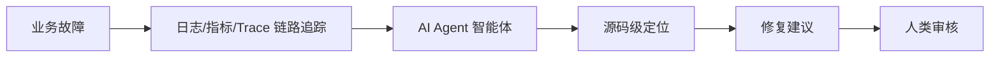
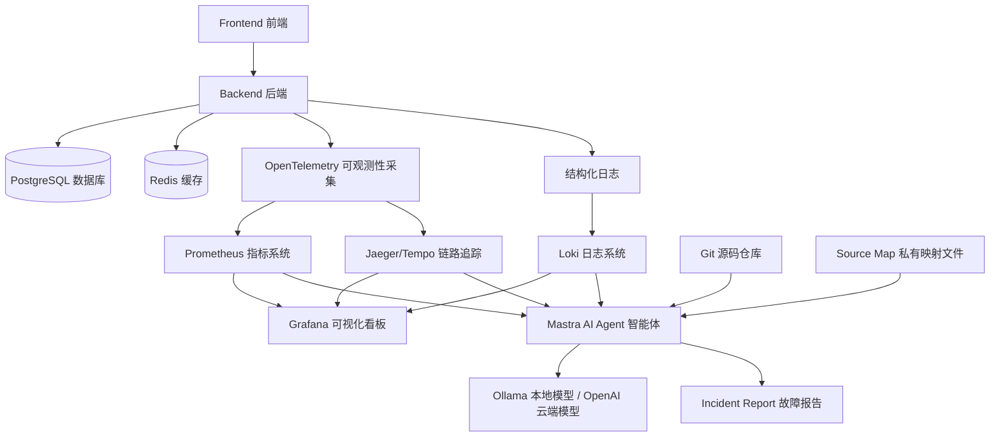
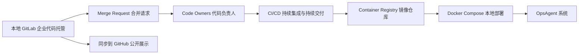
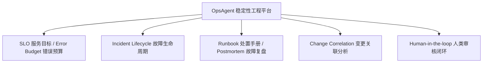
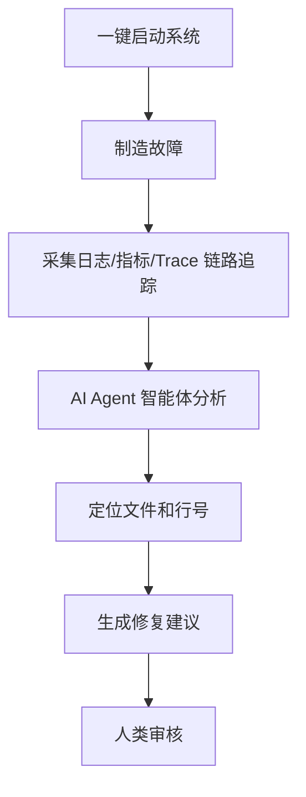

# OpsAgent

OpsAgent 是一个本地可运行的 AI Ops（智能运维）demo（演示项目）。它的目标是模拟企业系统上线之后的兜底能力：当服务出现错误、延迟升高、前端页面崩溃时，系统可以自动聚合日志、指标、链路追踪和源码上下文，再由 AI Agent（智能体）生成根因分析和修复建议，最后交给人类审核。

这个项目的定位不是“让 AI 自动改线上代码”，而是做一个更安全的 Copilot for Ops（运维辅助驾驶）：



## 项目目标

| 目标 | 说明 |
|---|---|
| 本地一键启动 | 使用 Docker Compose（容器编排工具）启动核心服务 |
| 企业架构模拟 | 使用 GitLab（企业代码托管平台）模拟内部研发流程 |
| 对外作品展示 | 同步到 GitHub（公开代码托管平台）方便面试展示 |
| 智能运维分析 | 使用 Mastra（智能体框架）实现 AI Ops Agent（智能运维智能体） |
| 可观测性闭环 | 接入 Prometheus（指标系统）、Loki（日志系统）、Grafana（可视化看板）、OpenTelemetry（可观测性采集标准） |

## 主创协作

| 成员 | 角色 |
|---|---|
| Vincent Huang | 项目发起人、产品构想、工程落地 |
| gpt5.5 | 架构设计主力、文档规划、技术路线设计 |
| DeepSeek | 后续协作伙伴、实现辅助、方案补强 |

## 推荐架构



## 本地 GitLab 企业模拟模式

我希望这个项目不仅能跑业务 demo（演示项目），也能模拟企业里的研发流程。因此会设计两种启动模式：

| 模式 | 命令 | 用途 |
|---|---|---|
| 标准模式 | `docker compose up -d` | 启动 OpsAgent 核心系统 |
| 企业模拟模式 | `docker compose --profile enterprise up -d` | 额外启动 GitLab（企业代码托管平台） |

企业模拟模式会覆盖：



这样面试时可以表达：

> 本地 GitLab（企业代码托管平台）模拟企业内部研发流程，GitHub（公开代码托管平台）用于作品展示。项目虽然是个人开发，但目录边界、合并审批、代码负责人和部署流程都按真实团队协作方式设计。

## 目录规划

```text
OpsAgent/
  docker-compose.yml
  apps/
    frontend/
    backend/
    agent/
  packages/
    api/
    db/
    env/
    config/
    shared/
  observability/
    prometheus/
    loki/
    otel/
    grafana/
  docs/
    architecture.md
    team-ownership.md
  CODEOWNERS
  README.md
```

| 目录 | 责任边界 |
|---|---|
| `apps/frontend/` | Frontend（前端）页面、错误上报、Source Map（源码映射文件） |
| `apps/backend/` | Backend（后端）接口、日志、Trace（链路追踪）埋点 |
| `apps/agent/` | Mastra（智能体框架）、Prompt（提示词）、Tools（工具调用）、Workflow（工作流） |
| `packages/api/` | tRPC（类型安全接口）共享 API（接口）定义 |
| `packages/db/` | Drizzle（轻量 ORM）和 PostgreSQL（关系型数据库）模型 |
| `packages/env/` | 环境变量校验 |
| `packages/config/` | TypeScript（类型脚本）通用配置 |
| `packages/shared/` | Incident（故障）、Evidence（证据）、Recommendation（建议）等共享类型 |
| `observability/` | Prometheus（指标）、Loki（日志）、Grafana（看板）、OpenTelemetry（采集） |
| `docs/` | 架构说明、面试讲解、团队 ownership（责任归属） |

M0（第 0 阶段）已参考 better-t-stack（TypeScript 全栈脚手架）生成的 `apps/web`、`apps/server`、`packages/api/db/env/config/ui` 基础结构，并按 OpsAgent 需求落地为 `apps/frontend`、`apps/backend`，同时补充 `apps/agent`、`packages/shared`、`observability` 和根级 `docker-compose.yml`。

## 项目文档

详细规划放在 [docs/AI-Ops-Demo-清单.md](docs/AI-Ops-Demo-清单.md)。

这份文档会持续记录：

| 内容 | 说明 |
|---|---|
| 架构设计 | AI Ops（智能运维）本地 demo（演示项目）的整体方案 |
| 环境清单 | 本机工具、Docker（容器）服务、Ollama（本地模型运行器）情况 |
| GitLab 企业模拟 | GitLab（企业代码托管平台）、Merge Request（合并请求）、Code Owners（代码负责人）和 CI/CD（持续集成与持续交付） |
| 开发里程碑 | 从最小业务系统到可观测性、Mastra（智能体框架）、Source Map（源码映射文件）定位 |
| 任务拆分 | [docs/task-breakdown.md](docs/task-breakdown.md) 记录 Milestone（里程碑）、任务卡、交付物和验收标准 |
| M0 闭环 | [docs/issues/M0-project-scaffold.md](docs/issues/M0-project-scaffold.md) 记录项目骨架与治理文件的执行边界 |
| M0.1 工作流门禁 | [docs/issues/M0.1-workflow-gates.md](docs/issues/M0.1-workflow-gates.md) 记录 hooks（钩子）从 shell 迁移到 TypeScript（类型脚本）的方案 |
| 团队责任 | [docs/team-ownership.md](docs/team-ownership.md) 记录 frontend-team（前端团队）、backend-team（后端团队）、ai-agent-team（智能体团队）、sre-team（稳定性团队）和 docs-team（文档团队）边界 |
| CodeGraph 代码图谱 | [docs/codegraph.md](docs/codegraph.md) 记录 CodeGraph（代码图谱工具）的使用边界和项目约束 |
| Agent 工作流 | [docs/workflows/agent-execution-workflow.md](docs/workflows/agent-execution-workflow.md) 记录 `/goal`、hooks（钩子）、门禁和完成汇报模板 |
| 开发日记 | [docs/devlog/2026-06-05-hook-bootstrap-decision.md](docs/devlog/2026-06-05-hook-bootstrap-decision.md) 记录 hook（钩子）先 shell 后 TypeScript 的架构决策 |
| 面试表达 | 如何把这个项目讲成一个真实企业 AI Ops（智能运维）闭环 |

## 核心高级能力

OpsAgent 不只是“把日志丢给大模型总结”，而是把 AI Ops（智能运维）设计成一个稳定性工程平台。



| 能力 | 中文解释 | 在项目里的价值 |
|---|---|---|
| SLO / Error Budget | 服务目标 / 错误预算 | 不只看有没有报错，而是判断服务是否违反稳定性目标 |
| Incident Lifecycle | 故障生命周期 | 覆盖发现、分析、处置、恢复、复盘的完整流程 |
| Runbook / Postmortem | 处置手册 / 故障复盘 | Agent（智能体）可以引用标准处理流程，并生成复盘报告 |
| Change Correlation | 变更关联分析 | 把故障和最近发布、commit（代码提交）、配置变更关联起来 |
| Human-in-the-loop | 人类审核闭环 | AI（人工智能）只生成建议，最终由开发者或 SRE（站点可靠性工程师）审核 |

## 模型策略

本机已经验证可以运行 `qwen2.5-coder:14b`，但 14B 模型较重，运行时约占用 `9.3 GB`，不适合作为默认演示模型。

推荐支持三种模型模式：

| 模式 | 用途 |
|---|---|
| OpenAI（云端模型） | 面试现场最稳 |
| Ollama（本地模型） | 本地离线推理，保护日志和源码隐私 |
| Mock（模拟结果） | 无网或模型不可用时兜底 |

```env
MODEL_PROVIDER=openai

# 或
MODEL_PROVIDER=ollama
OLLAMA_MODEL=qwen2.5-coder:14b

# 或
MODEL_PROVIDER=mock
```

## 面试展示重点



这个项目最终要展示的是：

| 能力 | 面试价值 |
|---|---|
| Docker Compose（容器编排） | 能把复杂系统本地一键启动 |
| GitLab（企业代码托管） | 有企业协作和权限治理意识 |
| Mastra（智能体框架） | 能做 AI Agent（智能体）工程落地 |
| Observability（可观测性） | 理解日志、指标、链路追踪 |
| Source Map（源码映射文件） | 理解前端生产故障如何定位源码 |
| GitHub（公开展示平台） | 方便面试官查看完整作品 |

## 未来展望

这些能力暂时不放进 MVP（最小可行产品），但可以作为后续演进方向：

| 能力 | 中文解释 | 后续价值 |
|---|---|---|
| Golden Signals | 黄金指标 | 用延迟、流量、错误、饱和度衡量服务健康 |
| Progressive Delivery | 渐进式发布 | 支持金丝雀发布、灰度发布和自动回滚 |
| Policy as Code | 策略即代码 | 把审批、安全、发布规则写成可版本管理的代码 |
| Audit Trail | 审计追踪 | 记录谁在什么时候触发了分析、审批和发布 |
| RBAC | 基于角色的权限控制 | 区分前端、后端、SRE（站点可靠性工程师）、Agent（智能体）团队权限 |
| Secret Management | 密钥管理 | 管理 API Key（接口密钥）、Token（访问令牌）、数据库密码 |
| SBOM | 软件物料清单 | 记录项目依赖和镜像里的软件组成 |
| Supply Chain Security | 软件供应链安全 | 做依赖漏洞扫描、镜像扫描和 CI（持续集成）安全检查 |
