# AI Ops 本地 Demo 清单

## 1. Demo 目标

把老师图里的企业级 AI Ops 架构，压缩成一个可以本地运行、可以放 GitHub、适合面试讲解的简化版系统。

核心闭环：


面试表达重点：

> 这个系统不是让 AI 自动改线上代码，而是把日志、指标、链路追踪、source map、Git 源码和历史故障上下文聚合起来，辅助开发者定位问题并生成可审核的修复建议。

## 2. 推荐项目形态

建议新建一个独立项目目录，例如：

```text
local-ai-ops-demo/
  docker-compose.yml
  frontend/
  backend/
  agent/
  observability/
    prometheus.yml
    loki.yml
    otel-collector.yml
    grafana/
      dashboards/
      datasources/
  docs/
    architecture.md
    incident-examples.md
  README.md
```

整体架构：

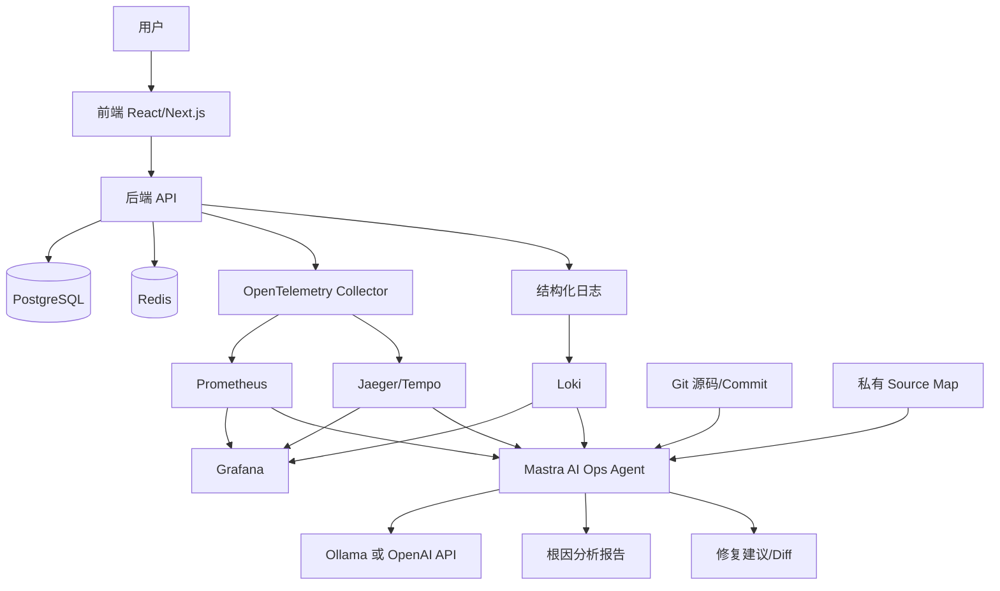

## 3. 当前电脑环境检查结果

| 项目 | 状态 | 备注 |
|---|---:|---|
| Git | 已安装 | `2.50.1` |
| GitHub CLI | 已安装 | `2.87.3` |
| Docker CLI | 已安装 | `29.5.2` |
| Docker daemon | 已启动 | Docker Desktop 可用 |
| Docker Compose | 已安装 | `v5.1.4` |
| Node.js | 已安装 | `v24.14.0` |
| npm | 已安装 | `11.13.0` |
| pnpm | 已安装 | `10.33.2` |
| Python | 已安装 | `3.14.4` |
| uv | 已安装 | 可用于 Python 项目管理 |
| Ollama | 已验证可用 | `qwen2.5-coder:14b` 可运行，但加载慢、占用高 |
| kubectl | 已安装 | demo 初期可不用 |
| Java | 已安装 | Java 8，demo 不依赖 |
| Homebrew | 已安装 | `5.1.14` |

Docker 当前情况：

| 项目 | 状态 |
|---|---:|
| Docker Server | `29.5.2` |
| 架构 | `aarch64`，Apple Silicon |
| Docker 可用内存 | 约 `7.75 GiB` |
| 当前运行容器 | `oneapi` |
| 已占用端口 | `3000` |

因此 demo 前端不建议占用 `3000`，推荐使用 `5173` 或 `3001`。

Ollama 当前实测情况：

| 项目 | 结果 |
|---|---:|
| 已安装模型 | `nomic-embed-text:latest`、`qwen2.5-coder:14b` |
| `nomic-embed-text:latest` 大小 | `274 MB` |
| `qwen2.5-coder:14b` 大小 | `9.0 GB` |
| 14B 烟测 | 成功返回 |
| 运行时驻留大小 | 约 `9.3 GB` |
| 处理器 | `100% GPU` |
| Context | `4096` |
| 结论 | 能跑，但不适合作为默认 demo 模型 |

## 4. 本机必须保留的工具

| 工具 | 用途 |
|---|---|
| Git | 代码版本管理 |
| GitHub CLI | 后续发布仓库、PR、Actions 辅助 |
| Docker Desktop | 一键启动中间件和服务 |
| Node.js / pnpm | 前端、Mastra、TypeScript 服务开发 |
| Python / uv | 如果后端或辅助脚本使用 Python |
| Ollama 或 OpenAI API Key | 给 AI Ops Agent 提供模型能力 |

## 4.1 模型运行策略

这台电脑可以跑 `qwen2.5-coder:14b`，但它启动和推理都偏重。为了让面试 demo 稳定，建议系统支持多模型模式，而不是绑定单一模型。

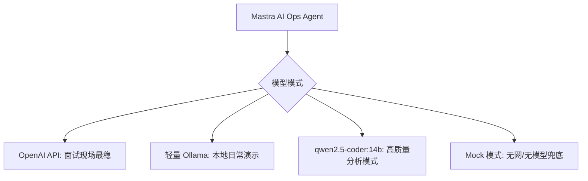

推荐配置：

```env
# 面试现场推荐
MODEL_PROVIDER=openai

# 本地离线演示
MODEL_PROVIDER=ollama
OLLAMA_MODEL=qwen2.5-coder:14b

# 无网/无模型兜底
MODEL_PROVIDER=mock
```

更稳的启动逻辑：

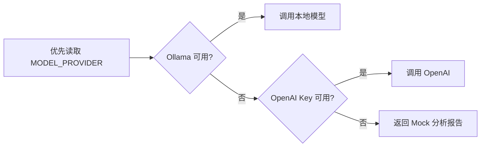

建议默认策略：

| 模式 | 适合场景 | 建议 |
|---|---|---|
| OpenAI API | 面试现场、录屏、稳定演示 | 默认推荐 |
| 轻量 Ollama 模型 | 本地日常开发 | 后续可补一个 7B/8B |
| `qwen2.5-coder:14b` | 深度代码分析 | 作为高级模式 |
| Mock 模式 | 无网、模型没启动、电脑资源紧张 | 必须保留 |

面试表达：

> Agent 支持本地模型和云端模型双模式。敏感日志和源码可以走 Ollama 本地推理；现场演示为了稳定可以切到 OpenAI；如果模型不可用，系统仍会返回 mock incident 报告，保证完整流程可展示。

## 5. 建议用 Docker 代替的组件

这些组件不要本机安装，全部放进 `docker-compose.yml`：

| 组件 | Docker 化建议 | 在 demo 中的作用 |
|---|---:|---|
| PostgreSQL | 是 | 业务数据库 |
| Redis | 是 | 缓存，可制造缓存异常场景 |
| Nginx | 是 | 网关/反向代理 |
| Prometheus | 是 | 指标采集与查询 |
| Grafana | 是 | 可视化 Dashboard |
| Loki | 是 | 日志聚合 |
| OpenTelemetry Collector | 是 | 指标/Trace/日志采集入口 |
| Jaeger 或 Tempo | 是 | 分布式链路追踪 |
| Alertmanager | 可选，是 | 告警路由 |
| MinIO | 可选，是 | 私有 source map / 构建产物存储 |
| Backend API | 可以 Docker | 面试展示时一键运行 |
| Frontend | 可以 Docker | 展示版一键运行 |
| Mastra Agent | 可以 Docker | AI Ops 分析服务 |

## 6. 推荐端口规划

| 服务 | 端口 |
|---|---:|
| 前端 | `5173` |
| 后端 API | `8000` |
| Mastra Agent API | `4111` 或 `8787` |
| Grafana | `3002` |
| Prometheus | `9090` |
| Loki | `3100` |
| Jaeger UI | `16686` |
| Tempo | `3200` |
| PostgreSQL | `5432` |
| Redis | `6379` |
| MinIO Console | `9001` |
| MinIO API | `9000` |

## 7. Mastra 在系统里的位置

Mastra 不是监控系统，也不是日志系统。它的位置是：

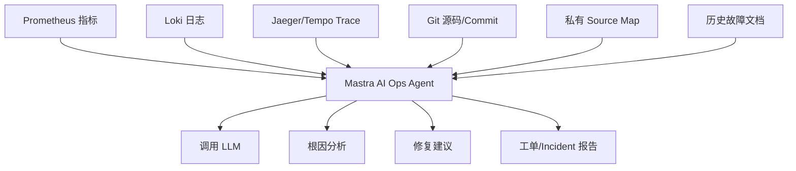

Mastra 适合承担：

| 能力 | 在 demo 中怎么体现 |
|---|---|
| Agent | AI Ops 分析大脑 |
| Workflow | 查指标 -> 查日志 -> 查 Trace -> 查源码 -> 生成报告 |
| Tools | 封装 Prometheus、Loki、Git、source map 查询 |
| Memory | 记录历史 incident 和处理建议 |
| RAG | 检索 README、代码说明、历史故障文档 |
| Evals | 判断 AI 输出质量，可作为进阶亮点 |
| MCP | 后续可接 GitHub、Issue、CI、数据库等工具 |

## 8. Source Map 的正确处理方式

生产环境前端不应该公开 source map。正确方式：

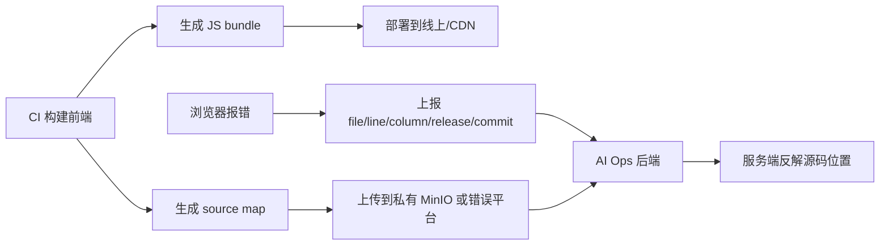

前端错误事件至少应包含：

| 字段 | 作用 |
|---|---|
| `release` | 匹配构建版本 |
| `dist` | 匹配构建批次 |
| `commit` | 关联 Git 代码 |
| `file` | 压缩后的 JS 文件 |
| `line` | 压缩后行号 |
| `column` | 压缩后列号 |
| `message` | 错误信息 |
| `stack` | 错误堆栈 |
| `traceId` | 关联后端请求链路，可选但加分 |

## 9. GitLab 与团队权限设计

虽然当前项目是个人开发，但建议按真实企业协作方式设计仓库边界。后续可以用 GitHub 托管展示，也可以用本地部署的 GitLab 做企业内网版演示。

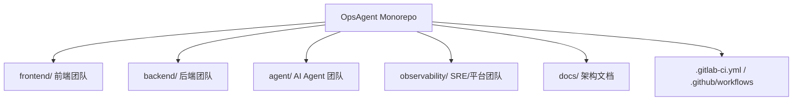

目录 ownership 建议：

| 路径 | 责任团队 | 说明 |
|---|---|---|
| `frontend/` | frontend-team | 前端页面、错误上报、source map 构建 |
| `backend/` | backend-team | 业务 API、结构化日志、Trace 埋点 |
| `agent/` | ai-agent-team | Mastra Agent、Tools、Workflow、Prompt、模型降级 |
| `observability/` | sre-team | Prometheus、Loki、Grafana、OTel、告警 |
| `docker-compose.yml` | sre-team + ai-agent-team | 本地一键启动与服务编排 |
| `docs/architecture.md` | 架构负责人 | 架构说明与演示讲稿 |
| `.gitlab-ci.yml` / `.github/workflows/` | sre-team | CI/CD、质量门禁、部署流程 |

GitLab 权限模型：

| 层级 | 建议 |
|---|---|
| Project Visibility | 私有项目，适合企业内部 |
| Protected Branch | `main` 禁止直接 push |
| Merge Request | 必须走 MR 合并 |
| Approvals | 关键目录要求对应 owner 审批 |
| Code Owners | 用 `CODEOWNERS` 维护目录负责人 |
| CI/CD Variables | 只给 Maintainer 管理 |
| Environments | 生产环境部署需要额外审批 |
| Container Registry | 存放前端、后端、Agent 镜像 |
| Package Registry | 可选，存放内部包 |

GitLab/GitHub 都可以使用类似的 `CODEOWNERS` 思路：

```text
# Default owner
* @daxiguaguagua-hash

/frontend/ @frontend-team
/backend/ @backend-team
/agent/ @ai-agent-team
/observability/ @sre-team
/docker-compose.yml @sre-team @ai-agent-team
/.gitlab-ci.yml @sre-team
/.github/workflows/ @sre-team
/docs/architecture.md @sre-team @ai-agent-team
```

合并流程：

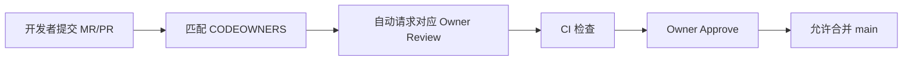

注意：GitHub/GitLab 通常不是靠“禁止某个人编辑某个目录”来治理，而是靠：

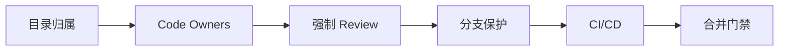

面试表达：

> 当前 demo 由个人完成，但工程结构按真实团队协作方式设计。前端、后端、Agent、可观测性配置都有明确 ownership。后续如果迁移到本地 GitLab，可以通过 Protected Branch、Merge Request、Code Owners、CI/CD Variables 和 Environment Approval 建立企业级协作边界。

## 10. 本地 GitLab 企业模拟模式

目标不是只做一个能跑的 demo，而是在本地尽量模拟企业内部研发平台：代码托管、合并审批、持续集成、镜像仓库、部署流程都能用 Docker Compose（容器编排工具）一键拉起来。

整体思路：

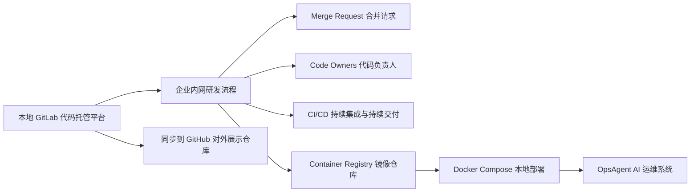

建议使用两种启动模式：

| 模式 | 命令 | 用途 |
|---|---|---|
| 标准模式 | `docker compose up -d` | 启动 OpsAgent 核心系统 |
| 企业模拟模式 | `docker compose --profile enterprise up -d` | 额外启动 GitLab，用来模拟企业研发流程 |

这样设计的原因：

| 原因 | 说明 |
|---|---|
| GitLab 较重 | GitLab（本地代码托管平台）会消耗较多内存，不适合默认每次启动 |
| 面试更稳 | 平时只启动核心系统，展示企业治理时再启动 GitLab |
| 结构清楚 | GitHub（对外展示平台）负责作品展示，GitLab（企业内网平台）负责流程模拟 |

推荐服务关系：

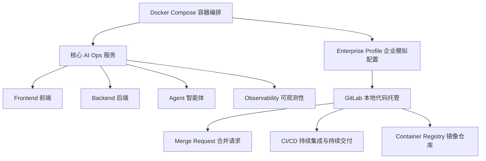

本地 GitLab 建议纳入 Docker Compose（容器编排工具），但使用 profile（可选启动配置）控制：

```yaml
services:
  gitlab:
    image: gitlab/gitlab-ce:latest
    profiles:
      - enterprise
    hostname: gitlab.local
    ports:
      - "8088:80"
      - "2222:22"
    volumes:
      - gitlab-config:/etc/gitlab
      - gitlab-logs:/var/log/gitlab
      - gitlab-data:/var/opt/gitlab

volumes:
  gitlab-config:
  gitlab-logs:
  gitlab-data:
```

注意事项：

| 项目 | 建议 |
|---|---|
| 端口 | GitLab Web 页面建议用 `8088`，避免占用常见端口 |
| SSH | GitLab SSH 建议映射到 `2222` |
| 首次启动 | GitLab 第一次初始化较慢，README 需要说明 |
| 密码/Token | 密码和访问令牌不要提交到 GitHub |
| 资源占用 | 面试现场可以展示截图或录屏，不一定现场启动 GitLab |
| 同步策略 | 本地 GitLab 负责企业流程，GitHub 负责公开展示 |

可以在项目里配置两个远程仓库：

```bash
git remote add origin git@localhost:2222:root/OpsAgent.git
git remote add github https://github.com/daxiguaguagua-hash/OpsAgent.git
```

发布展示时：

```bash
git push github main
```

面试表达：

> 我本地用 GitLab（企业代码托管平台）模拟公司内部研发流程，包括 Merge Request（合并请求）、Code Owners（代码负责人）、Protected Branch（受保护分支）、CI/CD（持续集成与持续交付）和 Container Registry（镜像仓库）。GitHub（公开代码托管平台）只作为对外展示仓库，这样既能展示工程治理意识，也方便面试官直接查看代码。

## 11. Demo 建议做的 3 个故障场景

| 场景 | 展示能力 | 期望输出 |
|---|---|---|
| 后端接口 500 | 日志 + Trace + 源码定位 | 定位到后端文件和异常行 |
| 接口延迟升高 | Prometheus 指标 + Trace | 判断慢接口或慢 SQL |
| 前端页面报错 | source map 私有反解 | 定位到 React/TSX 文件和行号 |

示例输出：

```text
Incident: Checkout 页面下单失败

影响范围:
- 前端页面: /checkout
- 后端接口: POST /api/orders
- 错误类型: TypeError

根因判断:
- 前端上报的压缩 JS 错误已通过私有 source map 反解
- 疑似源码位置: frontend/src/pages/Checkout.tsx:137
- 后端 trace 显示请求没有成功到达 payment-service

建议:
1. 检查 Checkout.tsx:137 对 order.total 的空值处理
2. 增加表单提交前校验
3. 增加对应单元测试

处理方式:
- 不自动合并代码
- 生成 patch 草案
- 交给开发者审核
```

## 12. 核心高级能力

这五个能力建议作为当前项目的高级卖点。它们不一定在 MVP（最小可行产品）第一天全部实现，但要进入架构设计和面试表达。

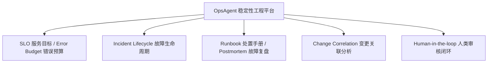

### 12.1 SLO / Error Budget

SLO（Service Level Objective，服务目标）用来定义服务应该达到什么稳定性水平。Error Budget（错误预算）表示在一段时间内系统允许失败的空间。

在 demo 中可以这样简化：

| 指标 | 示例 |
|---|---|
| 接口成功率 | `99%` |
| P95 延迟 | 小于 `500ms` |
| 错误预算 | 每 1000 次请求最多允许 10 次失败 |

Agent（智能体）输出时不只说“接口报错”，而是说：

```text
当前 POST /api/orders 错误率已经超过 SLO（服务目标），本小时错误预算消耗过快，建议暂停发布并进入故障分析流程。
```

### 12.2 Incident Lifecycle

Incident Lifecycle（故障生命周期）表示一次故障从发现到复盘的完整流程。

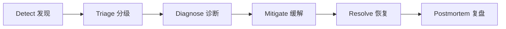

demo 中可以把 AI Ops Agent（智能运维智能体）的输出分成这些阶段：

| 阶段 | Agent 输出 |
|---|---|
| Detect 发现 | 发现错误率、延迟、异常日志 |
| Triage 分级 | 判断影响范围和严重程度 |
| Diagnose 诊断 | 关联日志、指标、Trace（链路追踪）、源码 |
| Mitigate 缓解 | 给出临时止血方案 |
| Resolve 恢复 | 给出修复建议和验证步骤 |
| Postmortem 复盘 | 自动生成故障复盘草稿 |

### 12.3 Runbook / Postmortem

Runbook（处置手册）是标准化的故障处理流程。Postmortem（故障复盘）是故障结束后的复盘文档。

建议在 `docs/` 里预留：

```text
docs/
  runbooks/
    api-5xx.md
    frontend-error.md
    high-latency.md
  postmortems/
    examples/
```

Agent（智能体）可以先检索 Runbook（处置手册），再输出建议：

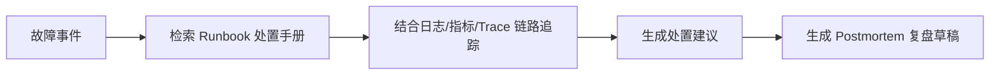

### 12.4 Change Correlation

Change Correlation（变更关联分析）用于判断故障是否和最近的代码、配置、依赖或部署变更有关。

可关联的数据：

| 数据 | 说明 |
|---|---|
| Git commit | 最近代码提交 |
| GitLab Merge Request | 最近合并请求 |
| Docker image tag | 最近镜像版本 |
| Config change | 配置变更 |
| Dependency update | 依赖升级 |

面试表达：

> 当故障发生时，Agent（智能体）不会只看日志，还会检查最近的 commit（代码提交）、Merge Request（合并请求）和镜像版本，把运行时异常和工程变更关联起来，缩小根因范围。

### 12.5 Human-in-the-loop

Human-in-the-loop（人类审核闭环）表示 AI（人工智能）不直接修改生产系统，而是生成建议，由人类确认后执行。

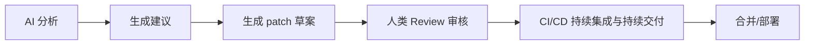

项目原则：

| 原则 | 说明 |
|---|---|
| AI 不直接上线 | 不自动合并代码，不自动发布生产 |
| 建议可追踪 | 每次分析要有输入证据和输出报告 |
| 人类可否决 | 开发者或 SRE（站点可靠性工程师）可以拒绝建议 |
| 结果可审计 | 记录分析时间、触发人、关联事件和建议内容 |

## 13. 未来展望

这些能力暂时不放入 MVP（最小可行产品），但可以作为后续演进方向。

| 能力 | 中文解释 | 后续价值 |
|---|---|---|
| Golden Signals | 黄金指标 | 用延迟、流量、错误、饱和度衡量服务健康 |
| Progressive Delivery | 渐进式发布 | 支持金丝雀发布、灰度发布和自动回滚 |
| Policy as Code | 策略即代码 | 把审批、安全、发布规则写成可版本管理的代码 |
| Audit Trail | 审计追踪 | 记录谁在什么时候触发了分析、审批和发布 |
| RBAC | 基于角色的权限控制 | 区分前端、后端、SRE（站点可靠性工程师）、Agent（智能体）团队权限 |
| Secret Management | 密钥管理 | 管理 API Key（接口密钥）、Token（访问令牌）、数据库密码 |
| SBOM | 软件物料清单 | 记录项目依赖和镜像里的软件组成 |
| Supply Chain Security | 软件供应链安全 | 做依赖漏洞扫描、镜像扫描和 CI（持续集成）安全检查 |

未来架构可以这样演进：

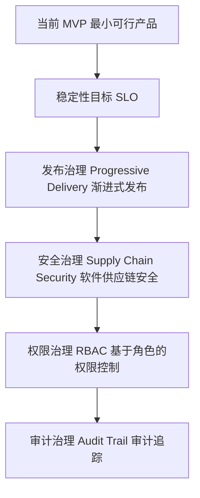

## 14. MVP 开发里程碑

### Phase 1: 最小业务系统

目标：先有一个可运行的前后端。

清单：

- [ ] React/Next.js 前端
- [ ] FastAPI 或 Node 后端
- [ ] PostgreSQL
- [ ] 一个正常接口
- [ ] 一个故意制造错误的接口
- [ ] `docker-compose.yml` 能启动基础服务
- [ ] 预留 SLO（服务目标）配置文件

### Phase 2: 可观测性

目标：让异常能被看见。

清单：

- [ ] 后端输出结构化日志
- [ ] 接入 Loki
- [ ] 接入 Prometheus
- [ ] 接入 OpenTelemetry
- [ ] 接入 Jaeger 或 Tempo
- [ ] Grafana 配好 datasource
- [ ] Grafana 有一个基础 Dashboard
- [ ] Dashboard 展示 Golden Signals（黄金指标）的简化版本

### Phase 3: AI Ops Agent

目标：让 Agent 能查数据并生成报告。

清单：

- [ ] 创建 Mastra Agent 服务
- [ ] Tool: 查询 Prometheus
- [ ] Tool: 查询 Loki
- [ ] Tool: 查询 Jaeger/Tempo
- [ ] Tool: 读取本地 Git 源码
- [ ] 支持 `MODEL_PROVIDER=openai|ollama|mock`
- [ ] 支持 Ollama 不可用时自动降级
- [ ] Agent 输出根因分析 Markdown
- [ ] 前端页面展示 AI 分析结果
- [ ] Agent 输出 Incident Lifecycle（故障生命周期）阶段
- [ ] Agent 关联最近 commit（代码提交）或构建版本

### Phase 4: 前端 Source Map 定位

目标：展示前端生产错误也能定位源码。

清单：

- [ ] 前端生产构建生成 source map
- [ ] source map 不公开给浏览器
- [ ] source map 上传到 MinIO 或本地私有目录
- [ ] 前端错误事件携带 release/file/line/column
- [ ] 后端做 symbolication
- [ ] Agent 结合源码输出修复建议
- [ ] 输出 Human-in-the-loop（人类审核闭环）说明

### Phase 5: 面试展示增强

目标：让 GitHub/GitLab 项目看起来像完整作品。

清单：

- [ ] README 写清楚架构图
- [ ] 一条命令启动：`docker compose up -d`
- [ ] 准备 3 个故障演示按钮
- [ ] 准备示例 incident 报告
- [ ] 准备 Grafana 截图
- [ ] 准备技术选型说明
- [ ] 准备 `CODEOWNERS` 或 GitLab Code Owners 示例
- [ ] 准备分支保护/MR 审批说明
- [ ] 准备 GitLab 企业模拟模式说明
- [ ] 准备 `docker compose --profile enterprise up -d` 启动说明
- [ ] 准备本地 GitLab 到 GitHub 的同步说明
- [ ] 准备 SLO/Error Budget（服务目标/错误预算）讲解
- [ ] 准备 Runbook/Postmortem（处置手册/故障复盘）示例
- [ ] 准备 Change Correlation（变更关联分析）示例
- [ ] 准备面试讲解稿

## 15. 推荐技术选型

| 模块 | 推荐 |
|---|---|
| 前端 | React + Vite 或 Next.js |
| 后端 | Node/NestJS 或 FastAPI |
| Agent | Mastra |
| LLM | Ollama 本地模型，或 OpenAI API |
| 数据库 | PostgreSQL |
| 缓存 | Redis |
| 指标 | Prometheus |
| 日志 | Loki |
| Trace | Jaeger 或 Tempo |
| 可视化 | Grafana |
| 采集 | OpenTelemetry Collector |
| 对象存储 | MinIO，可选 |
| 编排 | Docker Compose |

如果想保持技术栈统一，推荐：

```text
TypeScript 前端 + TypeScript 后端 + Mastra Agent + Docker Compose
```

如果想偏后端/AI Infra：

```text
React 前端 + FastAPI 后端 + Python Agent/LangGraph + Docker Compose
```

本项目更建议第一种，因为 Mastra 是 TypeScript-first，放到 GitHub 上结构更统一。

## 16. 一句话总结

这个 demo 最有价值的地方不是“把所有中间件都堆起来”，而是做出一个清晰闭环：

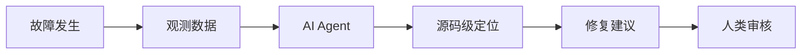

最终目标：

> 用 Docker Compose 一键启动一个本地版企业 AI Ops 系统，用 Mastra 作为智能分析大脑，展示从故障注入到源码定位再到修复建议的完整工程闭环。
