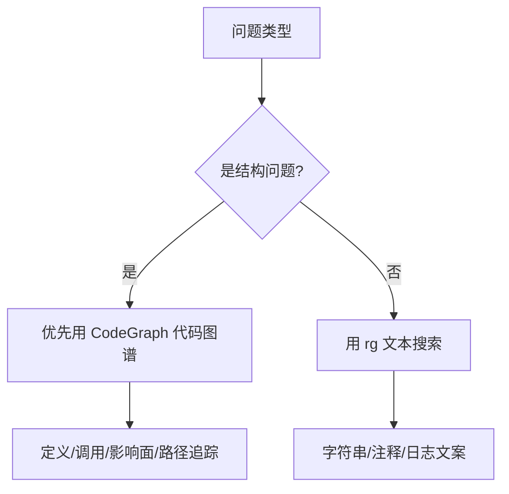

# CodeGraph 代码图谱

CodeGraph（代码图谱工具）用于把项目代码解析成可查询的结构图，方便快速回答“谁定义了这个符号”“谁调用了这个函数”“改这里会影响哪里”。

## 当前状态

| 项目 | 状态 |
|---|---|
| `.codegraph/` | 已存在 |
| `.codegraph/codegraph.db` | 已生成 |
| 适用阶段 | M0 开始持续使用 |
| 主要价值 | 结构查询、调用追踪、影响面分析 |

## 使用边界

| 问题 | 推荐方式 |
|---|---|
| Where is X defined?（X 在哪里定义） | CodeGraph |
| What calls Y?（谁调用 Y） | CodeGraph |
| What would changing Z break?（改 Z 会影响什么） | CodeGraph |
| Search this log text（搜索日志文本） | `rg` |
| Search TODO/comment（搜索注释） | `rg` |

## OpsAgent 里的价值

| 模块 | CodeGraph 价值 |
|---|---|
| `apps/frontend` | 追踪故障按钮、错误上报、报告展示组件 |
| `apps/backend` | 追踪 API（接口）、日志、Trace（链路追踪）埋点 |
| `apps/agent` | 追踪 Agent（智能体）分析流程和工具调用 |
| `packages/shared` | 追踪 Incident（故障）、Evidence（证据）、Recommendation（建议）类型影响面 |

## M0 约束

为了让 CodeGraph（代码图谱工具）发挥作用，M0 开始遵守这些规则：

| 规则 | 说明 |
|---|---|
| TypeScript-first | 优先 TypeScript（类型脚本） |
| ESM-first | 优先 ESM（现代模块系统） |
| 显式 import/export | 避免动态 `require` |
| 类型集中 | 共享类型放 `packages/shared` |
| 模块边界清晰 | 前端、后端、Agent（智能体）不要互相乱引用 |

## 面试表达

> 我在项目里接入了 CodeGraph（代码图谱工具），让 AI Agent（智能体）和开发者不仅能全文搜索，还能做符号级查询、调用链追踪和影响面分析。这对 AI Ops（智能运维）很关键，因为定位问题时不能只看日志，还要把运行时异常关联到代码结构。

