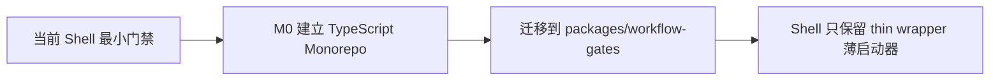
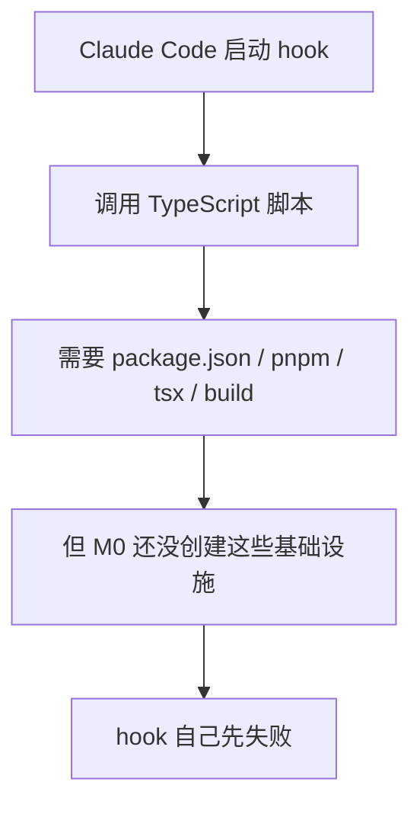

# 开发日记：Hook 为什么先用 Shell，而不是直接 TypeScript

日期：2026-06-05

## 背景

今天讨论 Claude Code hooks（钩子）时，Vincent 提了一个很自然的问题：

> 既然 OpsAgent 要走 TypeScript-first（类型脚本优先），为什么 hooks（钩子）不一开始就直接写成 TypeScript？

这个问题看起来简单，但实际上触到了 M0 阶段最核心的架构问题：bootstrap dependency（启动依赖）和 workflow gate（工作流门禁）的先后关系。

## 结论

当前阶段先用 shell（命令行脚本）实现最小门禁，等 M0 完成 TypeScript monorepo（单仓多项目）后，再把复杂逻辑迁移到 TypeScript。



## 原因

如果一开始就把 hooks 写成 TypeScript，会出现“鸡生蛋问题”：



也就是说，M0 正是要创建 TypeScript（类型脚本）基础设施，但如果 hook（钩子）先依赖这些基础设施，M0 还没开始，门禁就已经坏了。

## 当前策略

| 阶段 | 做法 | 原因 |
|---|---|---|
| M0 前 | shell 脚本直接跑 | 无依赖，能立刻保护 `.env`、密钥、危险命令 |
| M0 中 | shell 做最小验证 | 保证 Claude Code + DeepSeek 不跳过任务范围 |
| M0 后 | TypeScript 化 | 提高可维护性、可测试性、CodeGraph（代码图谱工具）友好度 |

## 最终形态

理想结构：

```text
.claude/
  hooks/
    pre-tool-guard.sh
    stop-check.sh

packages/
  workflow-gates/
    src/
      preToolGuard.ts
      stopCheck.ts
      rules/
        m0.ts
```

最终 shell 脚本应该只保留薄启动器：

```bash
#!/usr/bin/env bash
node packages/workflow-gates/dist/stopCheck.js
```

## 记录这个问题的原因

这个问题不是“傻问题”。它提醒我们：

- 架构设计不能只看最终形态，也要看启动路径。
- 工作流门禁本身也有依赖和生命周期。
- 好的架构不是一开始就做成最漂亮，而是按阶段让系统稳定演进。

## 决策状态

状态：接受。

后续任务：

- [ ] M0 完成后创建 `packages/workflow-gates`
- [ ] 把 `.claude/hooks/*.sh` 的复杂逻辑迁移到 TypeScript
- [ ] shell 只保留 thin wrapper（薄启动器）
- [ ] 为 workflow-gates 增加单元测试

