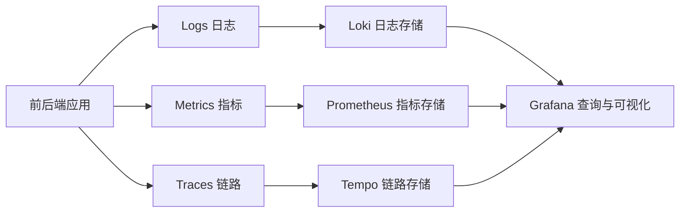
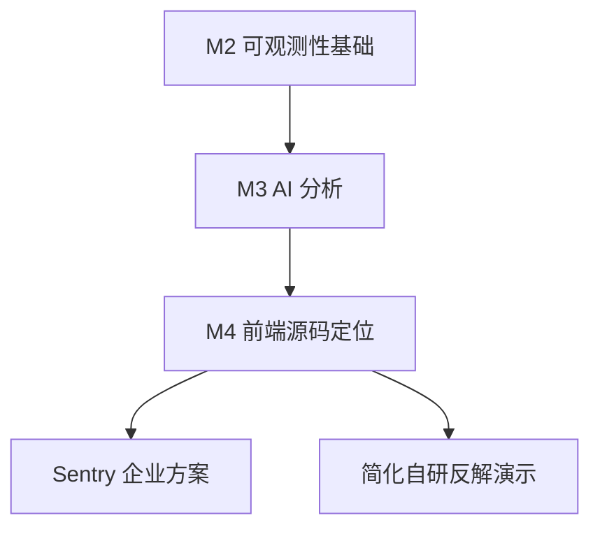

# 开发日记：第一次理解可观测性与 Sentry 的位置

日期：2026-06-06

## 今天的问题

进入 M2（可观测性基础闭环）前，Vincent 提出了几个关键问题：

> M2 里的工具我都没有用过。完成之后能看到页面吗？到底怎么“可观测”？Grafana 是不是汇总系统？Sentry 是不是前端监控库？

这些问题触及了可观测性架构最重要的边界：应用负责产生数据，存储系统负责保存不同类型的数据，Grafana 负责统一查询和展示，Sentry 则专注于应用异常及其源码上下文。

## 基础认识

| 信号 | 回答的问题 | 项目示例 |
|---|---|---|
| Metrics（指标） | 问题是否发生、影响多大 | 请求量、错误率、P95 延迟 |
| Logs（日​​志） | 某次请求具体发生了什么 | 路由、状态码、错误信息、`traceId` |
| Traces（链路追踪） | 请求慢或失败在哪个步骤 | HTTP、PostgreSQL、Redis 各自耗时 |

Grafana（可视化与分析平台）本身通常不负责产生业务观测数据，也不是所有数据的唯一存储。它连接 Prometheus、Loki、Tempo 等 Data Source（数据源），提供 Dashboard（看板）、Explore（查询分析）和 Alerting（告警）。

## Sentry 的位置

Sentry（应用性能与错误监控平台）最常见于前端，但也支持 Node.js 等后端运行环境。它特别擅长：

- 捕获浏览器未处理异常和 Promise rejection（异步拒绝）。
- 聚合、去重并统计同类错误。
- 记录 Release（发布版本）、浏览器和用户影响。
- 使用私有 Source Map（源码映射）把压缩代码位置还原到源码文件和行号。
- 提供 Breadcrumbs（异常前操作轨迹）和 Session Replay（会话回放）。

它与 M2 的开源可观测性栈存在部分能力重叠，但关注点不同：

| 问题 | 首选工具 |
|---|---|
| 接口错误率是否升高 | Prometheus |
| 某个 `traceId` 对应哪些日志 | Loki |
| 请求慢在 HTTP、数据库还是缓存 | OpenTelemetry + Tempo |
| 浏览器异常对应哪一行源码 | Sentry + Source Map |
| 统一查看指标、日志和链路 | Grafana |

## 项目决定

1. M2 继续实现 Prometheus、Loki、Tempo 和 Grafana，学习完整的开源可观测性闭环。
2. Sentry 放入 M4，作为前端生产错误定位的真实企业方案。
3. M4 保留简化的自研 symbolication（源码反解）流程，用于展示 Source Map 的底层原理。

## 面试说法

> OpsAgent 使用 Prometheus、Loki、Tempo 和 Grafana 构建指标、日志与链路追踪闭环；Sentry 在前端错误定位阶段负责异常聚合、发布版本关联和私有 Source Map 反解，同时项目保留简化的自研反解流程来展示底层原理。

## 决策状态

状态：接受。

