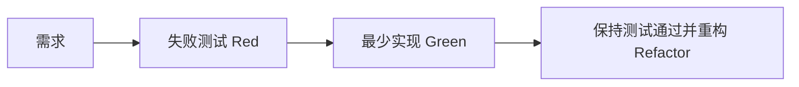
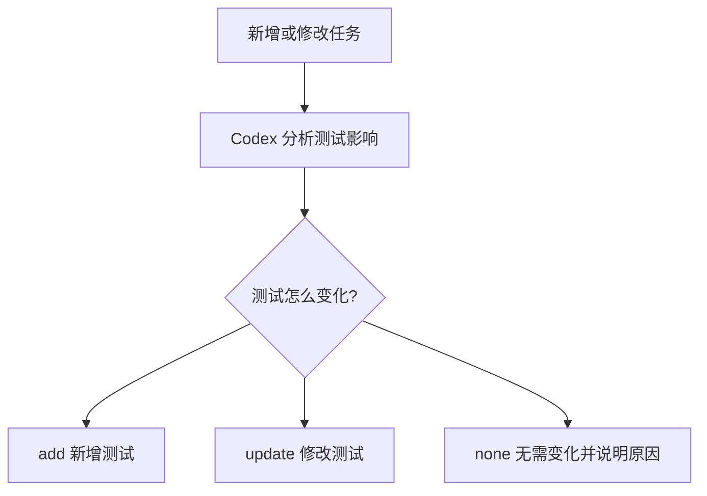
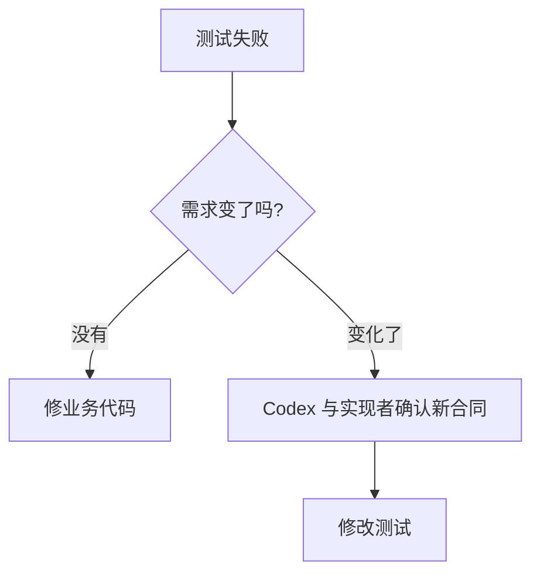

# 开发日记：TDD 与测试治理

日期：2026-06-06

## 今天的问题

> 为什么 TDD（测试驱动开发）要先写测试再写业务代码？业务代码还没有，到底在测什么？

这个疑问是合理的。TDD 不是测试尚不存在的实现，而是先把需求写成可以运行的行为合同。

例如需求是“critical（严重）故障必须进入人工审核”，测试先固定这个预期；业务代码随后实现它。测试约束的是需求行为，而不是提前猜测内部实现。

## 项目决定

OpsAgent 不采用所有代码都必须严格 TDD 的教条方案，而采用选择性 TDD：

| 场景 | 策略 |
|---|---|
| 业务规则、状态机、数据转换 | 优先 TDD |
| Bug（缺陷）修复 | 先写能复现 Bug 的失败测试 |
| Workflow Gate（工作流门禁） | 优先 TDD，尤其是放行和阻断规则 |
| 探索性 UI（用户界面） | 可以先实现，再补行为测试 |
| Docker（容器）和第三方集成 | 先做 spike（技术试验），再补集成测试 |

## 测试治理决定

以后新增或修改任务时，Codex 必须同步判断测试影响：

角色边界：

| 角色 | 测试职责 |
|---|---|
| Codex / test-strategist（测试策略角色） | 判断测试影响、设计测试用例、审核测试修改 |
| Claude Code + DeepSeek / implementer（实现角色） | 实现业务；可以提出修改测试，但不能单方面修改测试合同 |
| 全新上下文 Claude Code + DeepSeek / tester（测试角色） | 执行正常路径、失败路径、回归检查并提供证据 |
| gpt5.5 / reviewer（审查角色） | 审查实现和测试证据 |
| Human（人类） | 对争议和发布作最终决定 |

如果 Claude Code 认为已有测试需要修改：

1. 在活动任务的 `testImpact` 中标记 `action: update`。
2. 写清修改原因和提议者。
3. 与 Codex 讨论测试是否描述错误、需求是否变化，或只是实现没有满足合同。
4. 达成共识后记录 `reviewedBy: test-strategist` 和 `consensus: approved`。
5. 未达成共识前不得把任务送入审查或完成状态。

## 重要认识

测试失败不等于测试应该被修改。优先判断：

这条规则可以防止实现者为了让流水线变绿而降低测试标准。
