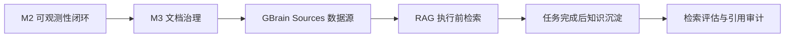

# 开发日记：GBrain RAG 与项目文档治理

日期：2026-06-07

## 今天的问题

在讨论 Agent（智能体）共享记忆时，Vincent 注意到：

> GBrain 主要根据 Markdown（文档）目录建立向量索引。如果项目采用 GBrain，当前文档的位置、主题边界和有效状态就会直接影响 RAG（检索增强生成）的质量。

这个判断成立。接入 GBrain 后，`docs/` 不再只是供人阅读的说明目录，也会成为 Agent 的项目知识来源。

## 调研结论

当前电脑安装的 GBrain 支持 Multi-source（多数据源），可以注册多个 Markdown 目录，不要求把所有文档放入同一个文件夹：

```bash
gbrain sources add <id> --path <目录>
gbrain sync --source <id>
gbrain sync --all
```

GBrain 默认可使用 PGLite（嵌入式 PostgreSQL），但当前电脑已经使用独立的 PostgreSQL + pgvector（向量扩展）容器。该方案更适合作为 Codex、Claude Code 和后续 Orchestrator（编排器）共享访问的知识服务。

## 项目决定

1. GBrain RAG 放入 M3，不属于当前 M2 可观测性闭环。
2. M2 完成前只记录设计，不迁移文档、不增加 GBrain 运行依赖。
3. 进入 M3 后，先治理文档，再建立向量索引。
4. 不把全部 Markdown 文档无差别写入知识库。
5. GBrain 负责历史知识检索，不取代 OpsAgent PostgreSQL 中的任务权威状态，也不取代 CodeGraph（代码图谱）的源码结构查询。



## 建议的知识目录

进入 M3 后再根据现有文档逐步整理：

```text
docs/
├── architecture/   # 当前有效的系统架构
├── decisions/      # ADR 架构决策记录
├── workflows/      # Agent 工作流和角色制度
├── runbooks/       # 故障处置手册
├── incidents/      # 故障报告与复盘
├── knowledge/      # 整理后的稳定知识
├── issues/         # 任务实施记录
├── devlog/         # 开发讨论和认知过程
└── archive/        # 已失效内容，默认不进入检索
```

优先进入 GBrain 的目录：

| 目录 | 默认策略 | 原因 |
|---|---|---|
| `architecture/` | 索引 | 描述当前有效架构 |
| `decisions/` | 索引 | 保存已经确定的技术决策 |
| `workflows/` | 索引 | 约束 Agent 的执行方式 |
| `runbooks/` | 索引 | 提供故障处置经验 |
| `incidents/` | 索引 | 支撑相似故障检索 |
| `knowledge/` | 索引 | 保存经过整理的稳定知识 |
| `issues/` | 选择性索引 | 可能包含过期的实施细节 |
| `devlog/` | 选择性索引 | 有认知价值，也包含讨论噪声 |
| `archive/` | 不索引 | 防止旧方案污染回答 |

## 文档规则

知识文档遵循以下原则：

1. 一个明确主题对应一个 Markdown 文件。
2. 文档使用 Frontmatter（头部元数据）标记类型、状态、负责人和更新时间。
3. 文档状态至少区分 `active`、`draft`、`superseded` 和 `archived`。
4. 已失效文档必须说明替代它的新文档。
5. 原始聊天可以归档，但只有任务摘要、架构决策、测试结论和故障经验进入默认检索。

示例：

```markdown
---
title: Agent 测试治理规则
type: workflow
status: active
milestone: M0
owners:
  - qa-team
  - ai-agent-team
updated: 2026-06-07
---
```

## 三层职责边界

| 系统 | 主要回答的问题 |
|---|---|
| OpsAgent PostgreSQL（数据库） | 当前任务真实处于什么状态？ |
| GBrain | 以前做过什么决定、遇到过什么问题？ |
| CodeGraph（代码图谱） | 当前代码在哪里、如何调用、修改会影响什么？ |

## 决策状态

状态：接受，延后至 M3 执行。
