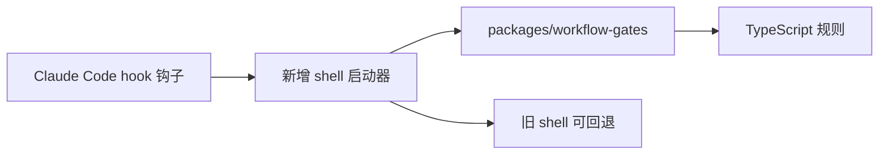

# M0-11 Workflow Gates 工作流门禁 TS 化

## 1. 目标

M0-11 的目标是把 Claude Code hooks（钩子）里的复杂判断迁移到 TypeScript（类型脚本），让规则更容易阅读、测试和扩展。

保留原则：

| 原则 | 说明 |
|---|---|
| 旧 shell 保留 | 原来的 `.claude/hooks/pre-tool-guard.sh` 和 `.claude/hooks/stop-check.sh` 不删除 |
| 新 shell 接管 | 新增 `.claude/hooks/pre-tool-guard-ts.sh` 和 `.claude/hooks/stop-check-ts.sh` |
| TS 写规则 | 复杂逻辑放到 `packages/workflow-gates` |
| 可回退 | 新 shell 执行失败时，仍可手动切回旧 shell |



## 2. 当前落地结构

```text
.claude/hooks/
  pre-tool-guard.sh       # 旧版 shell，保留
  stop-check.sh           # 旧版 shell，保留
  pre-tool-guard-ts.sh    # 新版 shell，调用 TS
  stop-check-ts.sh        # 新版 shell，调用 TS

packages/workflow-gates/
  src/
    preToolGuard.ts
    stopCheck.ts
    rules/
      m0.ts
    lib/
      hookPayload.ts
      io.ts
      repo.ts
```

## 3. 运行方式

Claude Code settings（配置）当前指向新增 shell：

| Hook | 命令 |
|---|---|
| PreToolUse（工具使用前） | `.claude/hooks/pre-tool-guard-ts.sh` |
| Stop（停止前） | `.claude/hooks/stop-check-ts.sh` |

新 shell 使用 Node.js 原生 TypeScript 类型剥离能力执行：

```bash
node --experimental-strip-types packages/workflow-gates/src/stopCheck.ts
```

这里没有使用 `tsx`，因为 `tsx` 在某些沙箱环境下会创建 IPC（进程间通信）管道，可能触发权限问题。

## 4. 已迁移规则

| 规则 | 状态 |
|---|---|
| 禁止写入 `.env`、私钥、证书文件 | 已迁移 |
| 拦截危险命令，如 `git reset --hard`、`rm -rf` | 已迁移 |
| M0 active-goal（当前目标）路径边界 | 已迁移 |
| M0 Stop（停止前）严格验收 | 已迁移 |
| 无 active-goal 时跳过严格验收 | 已迁移 |

## 5. 验证命令

```bash
pnpm -F @opsagent/workflow-gates check-types
pnpm check-types
pnpm build
bash .claude/hooks/stop-check-ts.sh
```

M0 严格验证方式：

```bash
printf 'M0\n' > .claude/active-goal
bash .claude/hooks/stop-check-ts.sh
rm .claude/active-goal
```

## 6. 面试表达

> 我没有把 hook（钩子）规则一直堆在 shell 里，而是把 shell 降级成启动器，把规则迁移到 TypeScript（类型脚本）包里。这样工作流门禁可以被类型检查、可以模块化扩展，也更适合后续让不同 Agent（智能体）遵守同一套工程规则。
