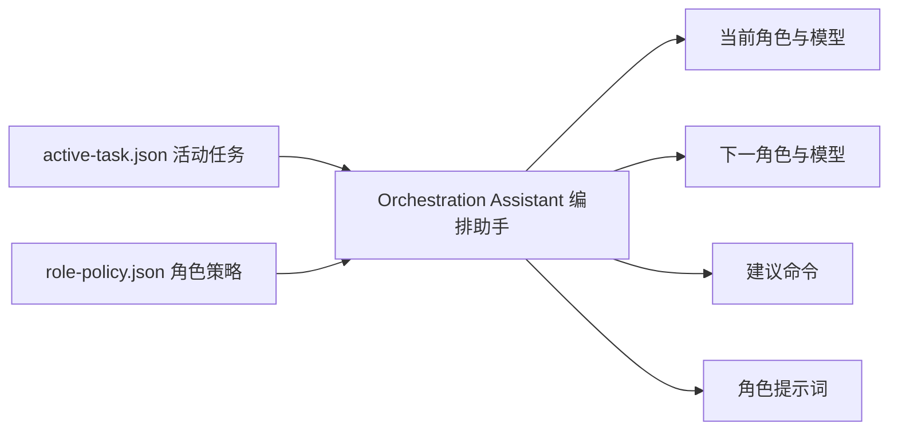

# M0-14 Orchestration Assistant 编排助手

日期：2026-06-06
状态：`done`（M0-17 验收通过）
前置任务：M0-13
负责人：ai-agent-team

## 1. 目标

M0-14 在原子任务命令之上增加组合命令和 Execution Brief（执行简报）。系统根据活动任务状态，确定当前角色、配置的模型、候补模型、下一角色、建议命令和角色 Prompt（提示词）。



## 2. 上层命令

| 命令 | 作用 |
|---|---|
| `pnpm task:next` | 查看当前执行者、下一执行者、命令和提示词，不修改状态 |
| `pnpm task:start` | 检查任务合同，满足条件后交给 Implementer（实现角色） |
| `pnpm task:review` | 检查测试门禁，满足条件后交给 Reviewer（审查角色） |
| `pnpm task:finish` | 完成任务并归档；高风险任务要求 Human Approver（人类批准角色） |

底层 `task:scope`、`task:handoff`、`task:evidence` 等原子命令继续保留，便于调试和处理非标准路径。

## 3. 示例流程

```bash
pnpm task:create -- M1-10 "实现登录功能" implementation
pnpm task:next

pnpm task:scope -- "apps/frontend/src/features/auth/**" "apps/backend/src/modules/auth/**"
pnpm task:criteria -- "用户可以使用邮箱和密码登录" "错误密码不能建立会话"
pnpm task:test-impact -- add "新增登录行为需要自动化测试" test-strategist
pnpm task:test-plan -- "正确凭证" "错误凭证" "未登录访问"
pnpm task:verify-command -- "pnpm test" "pnpm check-types" "pnpm build"

pnpm task:start
pnpm task:next
```

实现完成后：

```bash
pnpm task:handoff -- tester
pnpm task:next

pnpm test
pnpm check-types
pnpm build
pnpm task:evidence -- "测试、类型检查和构建通过"

pnpm task:review
pnpm task:next
pnpm task:finish
```

## 4. 状态与执行者

| 状态 | 当前角色 | 默认 Actor（执行者） |
|---|---|---|
| `planned` | Architect（架构角色） | `gpt5.5` |
| `implementing` | Implementer（实现角色） | `claude-code-deepseek` |
| `testing` | Tester（测试角色） | `claude-code-deepseek-new-context`，即全新 Claude Code + DeepSeek 会话 |
| `ready_for_review` | Reviewer（审查角色） | `gpt5.5` |
| `completed` | 完成状态 | 等待归档 |

## 5. 能力边界

Orchestration Assistant（编排助手）本身是确定性决策层，不直接启动模型。M0-15 Actor Runtime（执行者运行时）读取它生成的结果，再调用已注册的 Claude Code + DeepSeek 执行者。Codex 和 Human（人类）角色仍由当前会话和用户人工执行。

```text
M0-14：计算下一步 + 生成提示词 + 状态门禁
M0-15：Claude Code 模型适配器 + 进程调用 + 本地审计
后续：身份认证 + 自动恢复 + 多模型协商
```

这样让角色与状态机、模型调用、自动调度保持分层，避免治理规则与具体模型耦合。

Tester（测试角色）不再指向尚未实现的 `qa-agent`，而是明确绑定本机真实可用的 `claude-code-deepseek-new-context`。这里的 `new-context`（新上下文）表示测试阶段必须启动独立会话，不能继承 Implementer（实现角色）的会话历史。工具权限、超时、结构化输出和结果回写由 M0-15 Actor Runtime（执行者运行时）实现。
