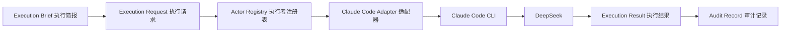
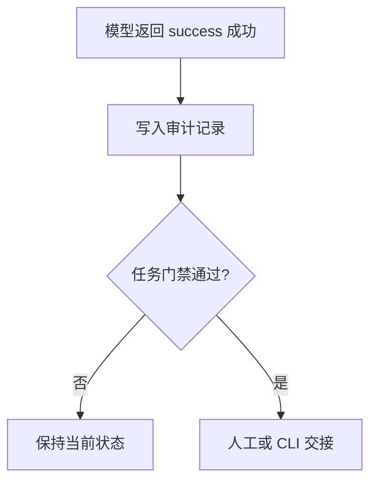

# M0-15 Actor Runtime 执行者运行时

日期：2026-06-06
状态：`done`（M0-17 验收通过）
前置任务：M0-14
负责人：ai-agent-team

## 1. 目标

M0-15 把 M0-14 生成的 Execution Brief（执行简报）转换为可执行的 Execution Request（执行请求），并通过 Claude Code Adapter（适配器）调用本机 Claude Code CLI（命令行工具）。



## 2. 执行者注册表

`.agent/actor-registry.json` 定义 Actor（执行者）如何运行。

| Actor（执行者） | Adapter（适配器） | 权限 |
|---|---|---|
| `claude-code-deepseek` | Claude Code | 读取、搜索、编辑、写入、执行命令 |
| `claude-code-deepseek-new-context` | Claude Code | 读取、搜索、执行测试；禁止编辑和写入 |
| `gpt5.5` | Manual（人工触发） | 当前 Codex 会话负责 |
| `codex` | Manual（人工触发） | 当前 Codex 会话负责 |
| `human` | Manual（人工触发） | 用户负责批准 |

Tester（测试角色）必须使用新会话：

```text
freshSession: true
no-session-persistence: true
Edit / Write / MultiEdit: denied
```

## 3. 命令

查看当前执行请求，但不调用模型：

```bash
pnpm task:execute -- --dry-run
```

实际调用当前 Actor（执行者）：

```bash
pnpm task:execute -- --approve-external-data
```

由于 Claude Code + DeepSeek 可能读取源码并把相关上下文发送到外部 API（接口），不带 `--approve-external-data`（批准外部数据传输）时，运行时必须拒绝执行。该参数只能在用户明确理解并批准数据边界后使用。

执行结果写入：

```text
.agent/executions/<task-id>/<timestamp>.json
```

该目录只用于本地审计，不提交 Git（版本控制）。

## 4. Claude Code 调用

Adapter（适配器）使用 Node.js `spawn`（子进程启动）直接执行参数，不经过 Shell（命令解释器）。

实现角色等价调用：

```bash
claude -p \
  --output-format json \
  --no-session-persistence \
  --setting-sources user,project \
  --permission-mode dontAsk \
  --allowedTools Read,Glob,Grep,Edit,Write,Bash \
  "<implementer prompt>"
```

测试角色等价调用：

```bash
claude -p \
  --output-format json \
  --no-session-persistence \
  --setting-sources user,project \
  --permission-mode dontAsk \
  --allowedTools Read,Glob,Grep,Bash \
  --disallowedTools Edit,Write,MultiEdit \
  "<tester prompt>"
```

本机 Claude Code 通过 Anthropic-compatible API（Anthropic 兼容接口）连接 DeepSeek。API Key（接口密钥）不进入项目配置和审计记录。

## 5. 安全边界



模型进程退出成功不代表任务完成。M0-15 不会：

- 自动把 Implementer（实现角色）的结果标记为测试通过。
- 自动把 Tester（测试角色）的文字报告写成测试证据。
- 自动推进到 Reviewer（审查角色）。
- 自动批准测试修改、提交 Git 或发布。
- 未经明确授权向外部模型发送仓库上下文。

状态推进仍由 `task:handoff`、`task:review` 和 `task:finish` 的确定性门禁负责。

## 6. 当前限制

- `gpt5.5`、`codex` 和 `human` 仍是 Manual（人工触发）执行者。
- 当前只解析 Claude Code 的 JSON（结构化数据）外层结果，尚未要求模型返回统一业务 Schema（结构定义）。
- 超时会终止子进程，但尚未实现自动重试和候补模型切换。
- 执行记录是本地文件，尚未接入 GitLab（企业代码托管平台）或数据库审计。
