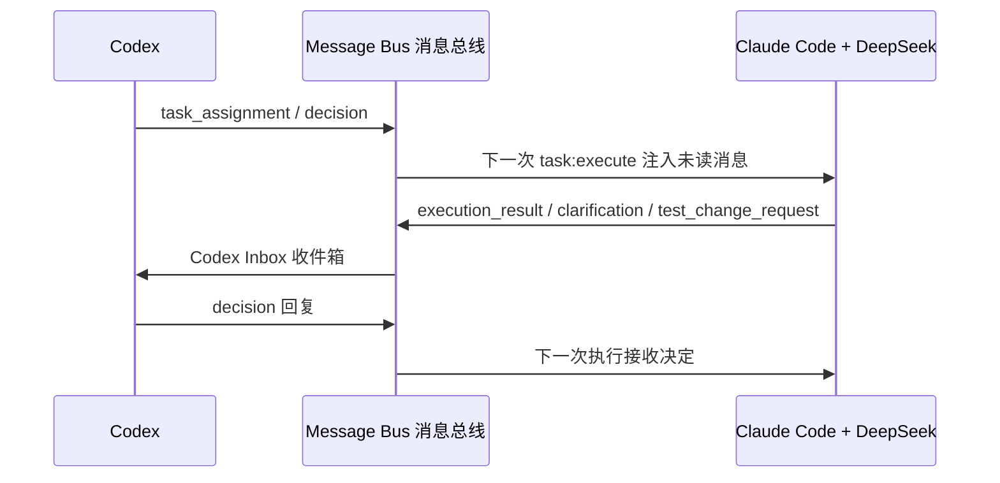
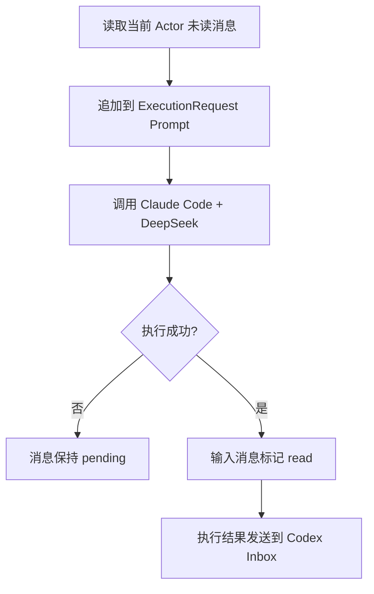
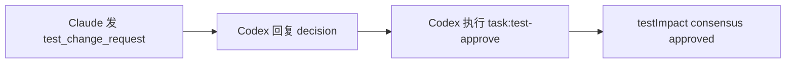

# M0-16 Agent Message Bus 智能体消息总线

日期：2026-06-06
状态：`done`（M0-17 验收通过）
前置任务：M0-15
负责人：ai-agent-team

> ⚠️ **已废弃**：自建消息总线（`messageBus.ts` / `messageCli.ts` / `messageBus.test.ts`）已在 M3 阶段移除，根 `package.json` 的 7 个 `msg:*` 脚本与 `taskTypes.ts` 的 `AgentMessageType` 等类型一并删除。多 Agent 协作已转向 `docs/workflows/agent-execution-workflow.md` 描述的编排引擎 + Actor Runtime。本卡片保留作为 M0 设计过程的历史记录。

## 1. 目标

M0-16 为 Codex 和 Claude Code + DeepSeek 建立文件型异步通信通道。消息可以投递、读取、回复、解决和归档，并被下一次 Actor Runtime（执行者运行时）调用注入 Prompt（提示词）。



## 2. 存储结构

```text
.agent/messages/
  inbox/<recipient>/
  outbox/<sender>/
  archive/<recipient>/
```

| 目录 | 作用 |
|---|---|
| `inbox` | 接收者等待处理或已经读取的消息 |
| `outbox` | 发送者的审计副本 |
| `archive` | 已解决消息 |

消息运行数据不提交 Git（版本控制）；结构定义保存在 `.agent/message.schema.json`。

## 3. 消息类型

| 类型 | 中文说明 | 示例 |
|---|---|---|
| `task_assignment` | 任务下发 | Codex 给 Claude Code 分配实现任务 |
| `execution_result` | 执行结果 | Claude Code 完成一次模型执行 |
| `test_change_request` | 测试修改申请 | 实现者认为测试合同需要调整 |
| `review_request` | 审查申请 | 请求 Codex 审查实现或证据 |
| `decision` | 决策 | Codex 批准或拒绝申请 |
| `clarification` | 澄清问题 | Claude Code 请求确认需求 |

状态：

```text
pending 待处理 → read 已读 → resolved 已解决并归档
```

## 4. CLI 命令

Codex 向 Claude Code 下发消息：

```bash
pnpm msg:send -- \
  M1-01 \
  codex \
  claude-code-deepseek \
  task_assignment \
  "实现登录功能" \
  "按照 active-task.json 的范围和验收标准实现。"
```

查看 Codex 收件箱：

```bash
pnpm msg:inbox -- codex
pnpm msg:inbox -- codex --unread
```

读取、回复和解决消息：

```bash
pnpm msg:show -- codex <message-id>
pnpm msg:read -- codex <message-id>

pnpm msg:reply -- \
  codex \
  <message-id> \
  codex \
  decision \
  "拒绝修改测试，请修复业务实现。"

pnpm msg:resolve -- codex <message-id>
```

查看发件箱：

```bash
pnpm msg:outbox -- codex
```

## 5. 与模型执行连接

`task:execute` 会执行以下流程：



Claude Code 可以使用 `msg:send` 发出澄清、测试修改或审查申请。下一次 Codex 回复会在 Claude Code 后续执行时自动进入 Prompt。消息按 `taskId` 隔离，不会把其他任务的未读消息注入当前任务。

## 6. 测试修改协商

消息只能表达协商内容，不能代替测试门禁：



只有消息中的“批准”而没有执行 `task:test-approve`，任务仍然不能送审。

## 7. 当前边界

- 当前是异步消息，不是两个模型之间持续保持连接的实时聊天。
- 当前消息中的 `from` 是流程声明，不是密码学身份认证；本地用户仍可伪造发送者。
- Codex 收件箱需要当前 Codex 会话或用户主动查看。
- Claude Code 的普通文本结果会自动包装为 `execution_result`，但不会自动识别成测试证据或状态变更。
- 消息目录是本地审计；后续可迁移到 PostgreSQL（关系型数据库）、Redis（缓存）或 GitLab（企业代码托管平台）。
- 外部 DeepSeek 调用仍要求 `--approve-external-data`（批准外部数据传输）。
