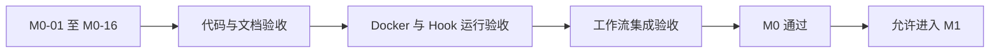

# M0-17 Milestone Acceptance 里程碑验收

日期：2026-06-06
状态：`accepted`
准入依据：M0-01 至 M0-16 全部通过

## 1. 验收结论

验收日期：2026-06-06。



**结论：M0 通过验收，可以进入 M1。**

M0-17 验收过程中发现两个缺口，均已修复并增加验证：

| 缺口 | 修复 |
|---|---|
| 根 `.env.example` 缺少 GitLab（企业代码托管平台）示例变量 | 增加 URL、HTTP 端口和 SSH 端口 |
| `testing` 类型任务不能从 `planned` 启动 | 通过内部合法状态路径进入 `testing`，增加回归测试 |

## 2. 任务状态

| 任务 | 交付物 | 状态 |
|---|---|---|
| M0-01 | `apps/`、`packages/`、`observability/`、`docs/` | 通过 |
| M0-02 | `.gitignore` | 通过 |
| M0-03 | 根 `.env.example` | 通过，已补 GitLab 示例 |
| M0-04 | pnpm Workspace（工作区）和 Turborepo（任务编排工具） | 通过 |
| M0-05 | `packages/shared` TypeScript（类型脚本）包 | 通过 |
| M0-06 | PostgreSQL 16、Redis 7 Docker Compose（容器编排） | 通过 |
| M0-07 | `CODEOWNERS`（代码负责人） | 通过 |
| M0-08 | 团队 Ownership（责任归属）文档 | 通过 |
| M0-09 | better-t-stack（TypeScript 全栈脚手架）试验记录 | 通过 |
| M0-10 | CodeGraph（代码图谱工具）说明与索引 | 通过 |
| M0-11 | TypeScript Hook（钩子）门禁 | 通过 |
| M0-12 | 角色与测试治理 | 通过 |
| M0-13 | Task Handoff CLI（任务交接命令） | 通过 |
| M0-14 | Orchestration Assistant（编排助手） | 通过 |
| M0-15 | Actor Runtime（执行者运行时） | 通过 |
| M0-16 | Agent Message Bus（智能体消息总线） | 通过 |

## 3. 验证证据

| 验证 | 结果 |
|---|---|
| `pnpm test` | 23 个测试全部通过 |
| `pnpm check-types` | 通过 |
| `pnpm build` | 通过 |
| `docker compose config` | 通过 |
| `docker compose ps` | PostgreSQL 和 Redis 均为 `healthy` |
| PostgreSQL `pg_isready` | `accepting connections` |
| Redis `PING` | `PONG` |
| PreToolUse Hook（工具使用前钩子） | 成功阻止写入 `.env` |
| Stop Hook（停止钩子） | M0 严格门禁通过 |
| CodeGraph（代码图谱工具） | 索引正常且为最新状态 |
| `.env` Git 检查 | 应用 `.env` 均被忽略，没有进入版本库 |
| Actor Runtime Dry-run（试运行） | Tester 使用全新会话，禁止编辑和写入 |
| Message Bus（消息总线） | Codex 消息按任务注入 Tester Prompt（提示词） |

## 4. 已知警告

以下问题不阻塞 M1：

| 警告 | 处理计划 |
|---|---|
| Frontend（前端）生产包约 582 KB，超过 500 KB 提示线 | M1 页面和路由稳定后做代码分割 |
| `tsdown` 的 `noExternal` 配置已弃用 | 在 M1 后端任务中迁移到 `deps.alwaysBundle` |
| Message Bus 的发送者是流程声明，不是密码学身份 | 后续接入 GitLab 权限或服务身份 |
| DeepSeek 是外部模型，可能读取仓库上下文 | 保留 `--approve-external-data` 人类授权门禁 |
| GitLab 企业模拟尚未落地 | 属于 M5，不阻塞 M1 |

## 5. M1 准入条件

| 条件 | 状态 |
|---|---|
| M0 交付物完整 | 满足 |
| 核心测试与构建通过 | 满足 |
| Docker 基础依赖健康 | 满足 |
| 工作流门禁可执行 | 满足 |
| 任务和消息状态可审计 | 满足 |
| 阻塞问题清零 | 满足 |

M1 开始前先执行 Baseline Audit（基线审计），确认 better-t-stack 已经提供的前端、后端、数据库和 tRPC（类型安全接口）能力，避免重复搭建。

## 6. 冻结建议

完成 M0-17 提交后建议创建 Git Tag（版本标签）：

```bash
git tag -a m0-complete -m "M0 项目骨架与工作流治理完成"
git push origin main
git push origin m0-complete
```

Tag（标签）和远端推送属于 Human Approver（人类批准角色）操作，不由验收脚本自动执行。
