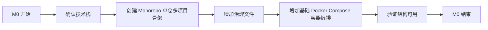
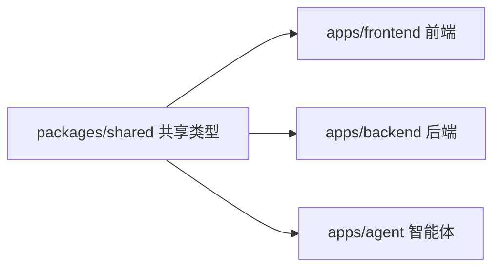
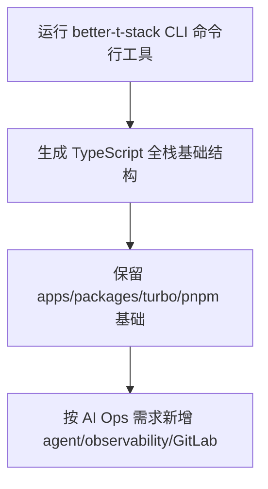

# M0 项目骨架与治理文件

## 1. 目标

M0 是 OpsAgent 的第一个工程闭环。目标不是实现业务功能，而是先把项目骨架、技术约束、治理文件和后续协作规则定下来。



## 2. 背景

OpsAgent 是跨端项目，包含 Frontend（前端）、Backend（后端）、Agent（智能体）、Observability（可观测性）和 GitLab（企业代码托管平台）企业模拟能力。

为了避免后续返工，M0 必须先确定这些工程原则：

| 原则 | 说明 |
|---|---|
| TypeScript-first | 全项目优先 TypeScript（类型脚本） |
| ESM-first | 优先使用 ESM（现代模块系统），避免 CommonJS（旧模块系统） |
| Monorepo | 使用单仓多项目结构管理前端、后端、Agent、共享类型 |
| CodeGraph-friendly | 代码结构要便于 CodeGraph（代码图谱工具）做符号索引、调用追踪和影响面分析 |
| Docker-first infra | 数据库、缓存、可观测性组件优先用 Docker（容器）启动 |
| Human-in-the-loop | AI（人工智能）只生成建议，不自动合并、不自动上线 |

## 3. 技术决策

### 3.1 Monorepo 结构

采用 `apps/` + `packages/` 结构。M0 先参考 better-t-stack（TypeScript 全栈脚手架）生成的基础结构，再按 OpsAgent 的 AI Ops（智能运维）需求扩展：

```text
OpsAgent/
  apps/
    frontend/
    backend/
    agent/
  packages/
    shared/
  observability/
  docs/
  docker-compose.yml
  package.json
  pnpm-workspace.yaml
  turbo.json
```

关系：



better-t-stack（TypeScript 全栈脚手架）本次实际生成的基础结构：

```text
opsagent-better-t-stack-baseline/
  apps/
    web/
    server/
  packages/
    api/
    db/
    env/
    config/
    ui/
  package.json
  pnpm-workspace.yaml
  turbo.json
```

OpsAgent 已在此基础上做的结构调整：

| 类型 | 目录 | 来源 | 说明 |
|---|---|---|---|
| 已保留并改名 | `apps/frontend` | `apps/web` | Frontend（前端）业务界面与故障演示页面 |
| 已保留并改名 | `apps/backend` | `apps/server` | Backend（后端）API（接口）与可观测性埋点 |
| 已新增 | `apps/agent` | OpsAgent 自定义 | Mastra（智能体框架）AI Ops Agent（智能运维智能体） |
| 保留 | `packages/api` | better-t-stack | tRPC（类型安全接口）共享 API（接口）定义 |
| 保留 | `packages/db` | better-t-stack | Drizzle（轻量 ORM）和 PostgreSQL（关系型数据库）模型 |
| 保留 | `packages/env` | better-t-stack | 环境变量校验 |
| 保留 | `packages/config` | better-t-stack | TypeScript（类型脚本）通用配置 |
| 可能调整 | `packages/ui` | better-t-stack | UI（用户界面）组件包，是否保留待定 |
| 已新增 | `packages/shared` | OpsAgent 自定义 | Incident（故障）、Evidence（证据）、Recommendation（建议）等共享类型 |
| 已新增 | `observability/` | OpsAgent 自定义 | Prometheus（指标）、Loki（日志）、Grafana（看板）、OpenTelemetry（采集）配置入口 |
| 已新增 | `docker-compose.yml` | OpsAgent 自定义 | 当前编排 PostgreSQL 和 Redis，后续扩展可观测性组件和 GitLab（企业代码托管平台） |

### 3.2 包管理与任务编排

| 工具 | 作用 |
|---|---|
| pnpm workspace | 管理 monorepo（单仓多项目）依赖 |
| Turborepo | 管理 dev/build/test/lint 任务编排和缓存 |
| TypeScript | 提供跨端类型安全 |
| Docker Compose | 本地启动 PostgreSQL、Redis 等依赖 |

M0 只使用 Turborepo（任务编排工具）的最小能力：

```json
{
  "tasks": {
    "build": {
      "dependsOn": ["^build"],
      "outputs": ["dist/**"]
    },
    "dev": {
      "cache": false,
      "persistent": true
    },
    "test": {
      "dependsOn": ["^build"]
    },
    "lint": {}
  }
}
```

暂时不引入：

| 暂不引入 | 原因 |
|---|---|
| remote cache | 远程缓存，当前个人开发暂时不需要 |
| 复杂发布 pipeline | 发布流程还没开始 |
| 多环境矩阵 | v0.1 先聚焦本地 demo（演示项目） |

### 3.3 better-t-stack 使用策略

Better-T-Stack 是 TypeScript（类型脚本）全栈项目脚手架。它适合参考，但不直接决定 OpsAgent 架构。

M0 中把它作为 bootstrap（启动脚手架）和 spike（技术试验）的结合：



本次已跑通的复现命令：

```bash
pnpm create better-t-stack@latest opsagent-better-t-stack-baseline --frontend tanstack-router --backend hono --runtime node --database postgres --orm drizzle --api trpc --auth none --payments none --addons turborepo --examples none --db-setup docker --web-deploy none --server-deploy none --no-git --package-manager pnpm --no-install
```

选择结果：

| 选项 | 结果 |
|---|---|
| Frontend（前端） | TanStack Router（React 路由方案） |
| Backend（后端） | Hono（轻量 Web 框架） |
| Runtime（运行时） | Node.js |
| Database（数据库） | PostgreSQL |
| ORM（对象关系映射） | Drizzle |
| API（接口） | tRPC |
| Auth（认证） | None，M0 暂不启用 |
| Addons（附加能力） | Turborepo |
| Examples（示例代码） | None，避免 Todo（待办示例）污染项目叙事 |
| Postgres setup（PostgreSQL 设置） | Docker（容器） |
| Package manager（包管理器） | pnpm |
| Install dependencies（安装依赖） | No，先观察结构 |

注意事项：

| 项目 | 结论 |
|---|---|
| 生成位置 | 本次生成在 `/tmp/opsagent-better-t-stack-baseline`，未直接写入 OpsAgent 仓库 |
| PostgreSQL 镜像 | 脚手架默认写 `image: postgres`，没有固定版本 |
| OpsAgent 处理 | 后续正式 `docker-compose.yml` 建议固定为本机已有 `postgres:16` |

验收方式：

| 项目 | 标准 |
|---|---|
| 是否必须采用 | 部分采用 |
| 是否必须调研 | 是，已完成一轮 CLI（命令行工具）试跑 |
| 产出 | 文档记录采用/不采用哪些结构，正式代码结构已开始落地 |

### 3.4 CodeGraph 友好约束

为了让 CodeGraph（代码图谱工具）后续能快速回答“哪里定义、谁调用、改了影响谁”，M0 开始就避免动态结构。

约束：

| 约束 | 说明 |
|---|---|
| 显式 `import/export` | 避免动态 `require` |
| 共享类型集中 | 重要业务类型放 `packages/shared` |
| 函数命名清晰 | 便于符号搜索 |
| 模块边界稳定 | frontend/backend/agent 不互相乱引用 |
| 类型优先 | 重要数据结构必须有 interface/type |

示例共享类型：

```ts
export interface IncidentReport {
  id: string;
  severity: "low" | "medium" | "high" | "critical";
  summary: string;
  evidence: Evidence[];
  recommendations: Recommendation[];
}
```

## 4. 范围

### 4.1 M0 必须做

| 任务 ID | 任务 | 优先级 |
|---|---|---:|
| M0-01 | 创建 `apps/`、`packages/`、`observability/`、`docs/` 目录结构 | P0 |
| M0-02 | 增加 `.gitignore` | P0 |
| M0-03 | 增加 `.env.example` | P0 |
| M0-04 | 增加 `package.json`、`pnpm-workspace.yaml`、`turbo.json` | P0 |
| M0-05 | 增加 `packages/shared` 最小 TypeScript 包 | P0 |
| M0-06 | 增加基础 `docker-compose.yml`，包含 PostgreSQL 和 Redis | P0 |
| M0-07 | 增加 `CODEOWNERS` 示例 | P1 |
| M0-08 | 增加 `docs/team-ownership.md` | P1 |
| M0-09 | better-t-stack spike（技术试验）并记录结论 | P1 |
| M0-10 | 增加 CodeGraph 初始化说明 | P1 |

### 4.2 M0 不做

| 不做 | 原因 |
|---|---|
| 前端页面实现 | 放到 M1 |
| 后端业务接口 | 放到 M1 |
| Mastra Agent 实现 | 放到 M3 |
| Prometheus/Loki/Grafana | 放到 M2 |
| GitLab 企业模拟 Compose profile | 放到 M5 |
| Source Map 反解 | 放到 M4 |

## 5. 验收标准

M0 完成时必须满足：

| 验收项 | 标准 |
|---|---|
| 目录结构 | `apps/frontend`、`apps/backend`、`apps/agent`、`packages/shared` 存在 |
| TypeScript 基础 | `packages/shared` 可以通过 `pnpm build` 构建 |
| Turbo 基础 | 根目录存在 `turbo.json`，根命令定义 `dev/build/test/lint` |
| Workspace 基础 | `pnpm-workspace.yaml` 覆盖 `apps/*` 和 `packages/*` |
| Docker 基础 | `docker compose config` 能通过配置检查 |
| 环境示例 | `.env.example` 包含数据库、Redis、模型 provider（模型提供方） |
| 文档入口 | README（项目说明）能链接到任务拆分和 M0 文档 |
| 安全 | `.env`、密钥、Token（访问令牌）不会进入 Git |
| 来源说明 | 文档说明哪些结构来自 better-t-stack，哪些是 OpsAgent 后续自定义 |

## 6. 验证命令

M0 的验证命令：

```bash
pnpm install
pnpm build
pnpm lint
docker compose config
git status --short
```

如果某个命令暂时不能运行，必须在最终汇报里说明原因。

## 7. Agent 执行工作流

通用流程见：[docs/workflows/agent-execution-workflow.md](../workflows/agent-execution-workflow.md)

使用 Claude Code 或 DeepSeek 执行 M0 时，推荐使用这个 `/goal`：

```text
/goal M0 项目骨架闭环完成：apps/frontend、apps/backend、apps/agent、packages/shared、observability、docs 目录存在；pnpm workspace 和 turbo 最小配置可用；packages/shared 可构建；docker-compose.yml 至少包含 PostgreSQL 和 Redis 且 docker compose config 通过；.gitignore、.env.example、CODEOWNERS 和 docs/team-ownership.md 已创建；README 链接到 M0 文档；git status 干净或只剩用户明确允许的改动。
```

M0 专属 Stop Gate（停止门）除了通用检查外，还要检查：

- [ ] `apps/frontend`、`apps/backend`、`apps/agent`、`packages/shared` 是否存在
- [ ] `pnpm-workspace.yaml` 和 `turbo.json` 是否存在
- [ ] `packages/shared` 是否可构建
- [ ] `docker compose config` 是否通过
- [ ] `.env.example` 是否覆盖数据库、Redis、模型 provider（模型提供方）

## 8. 完成汇报模板

M0 完成后汇报：

```text
M0 完成情况：
- 已完成：
- 未完成/延期：
- 验证命令：
- 风险：
- 下一步建议：
```

## 9. 当前状态

状态：待开始。

下一步：


