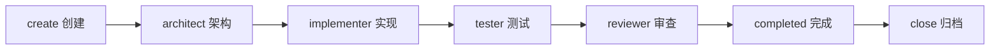
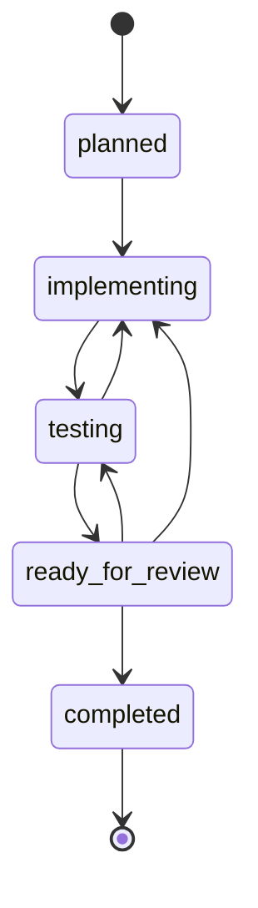

# M0.3 Task Handoff CLI 任务交接命令

## 1. 目标

M0.3 把角色策略从“文档制度”推进成“可执行任务流”。CLI（命令行工具）管理 `.agent/active-task.json`，记录当前负责人、状态、测试影响、测试证据和交接历史。



## 2. 命令

| 命令 | 作用 |
|---|---|
| `pnpm task:create -- <id> "<title>" [taskType]` | 创建活动任务 |
| `pnpm task:show` | 查看当前任务 |
| `pnpm task:scope -- "<path>"...` | 设置任务文件范围 |
| `pnpm task:criteria -- "<criterion>"...` | 设置验收标准 |
| `pnpm task:test-impact -- <add/update/none> "<reason>" [proposedBy]` | 记录 Codex 测试影响结论 |
| `pnpm task:test-approve` | 由 Codex 明确批准实现者提出的测试修改 |
| `pnpm task:test-plan -- "<case>"...` | 设置测试计划 |
| `pnpm task:verify-command -- "<command>"...` | 设置验证命令 |
| `pnpm task:handoff -- <role>` | 交接给下一角色并推进状态 |
| `pnpm task:evidence -- "<result>"` | 添加测试证据 |
| `pnpm task:status -- <status>` | 显式更新任务状态 |
| `pnpm task:validate` | 校验活动任务 |
| `pnpm task:close` | 归档已完成任务并释放活动任务 |

## 3. 状态机



禁止直接从 `planned` 跳到 `completed`。

## 4. 送审条件

进入 `ready_for_review` 前必须满足：

| 条件 | 门禁 |
|---|---|
| Codex 已完成 `testImpact` 测试影响分析 | 必须 `consensus: approved` |
| Tester（测试角色）已提供证据 | `testEvidence` 不能为空 |
| 任务范围和验收标准已定义 | 不允许保留 `TODO` |
| 测试计划和验证命令已定义 | 不允许保留 `TODO` |

## 5. 验证

```bash
pnpm test
pnpm check-types
pnpm build
```

当前测试覆盖：

1. 创建任务时应用默认角色策略。
2. Architect（架构角色）交接到 Implementer（实现角色）和 Tester（测试角色）。
3. 没有测试共识或测试证据时禁止送审。
4. 带 `TODO` 占位内容时禁止送审。
5. 非法状态跳跃被阻断。

## 6. 能力边界

CLI（命令行工具）负责记录交接和批准结果，但不能证明实际调用者就是声明的 AI（人工智能）角色。当前版本通过 Git（版本控制）权限、代码审查和人工纪律约束；可验证身份与自动多 AI 调度属于后续 orchestrator（编排器）阶段。
