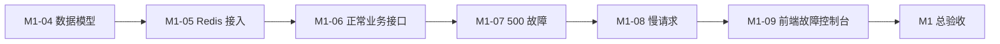

# M1-01 技术栈确认与基线审计

日期：2026-06-07
状态：`done`（M1 验收通过）
负责人：Vincent Huang

## 1. 结论

OpsAgent 沿用 better-t-stack（全栈脚手架）生成的 TypeScript（类型脚本）技术栈，不重新搭建前后端。

| 领域 | 选型 | 当前状态 |
|---|---|---|
| Monorepo（单仓多项目） | pnpm workspace + Turborepo（增量构建工具） | 已具备 |
| Frontend（前端） | React 19 + Vite 8 + TanStack Router + TanStack Query | 已具备骨架 |
| API（应用程序接口） | tRPC 11 | 已具备健康检查 |
| Backend（后端） | Node.js + Hono | 已具备服务入口 |
| Database（数据库） | PostgreSQL 16 + Drizzle ORM（对象关系映射） | 容器和连接工厂已具备，业务表缺失 |
| Cache（缓存） | Redis 7 | 容器已具备，应用接入缺失 |
| UI（用户界面） | Tailwind CSS + shadcn/ui 风格共享组件 | 已具备基础组件 |
| Workflow（工作流） | TypeScript CLI（命令行工具）+ hooks（钩子）+ Message Bus（消息总线） | M0 已验收 |

## 2. M1 差距

| 任务 | 状态 | 审计结果 |
|---|---|---|
| M1-01 选择前后端技术栈 | 已完成 | 沿用现有 TypeScript 全栈，不引入 Next.js、NestJS 或 FastAPI |
| M1-02 搭建前端项目 | 已具备 | 前端可构建，当前页面仍是脚手架模板 |
| M1-03 搭建后端项目 | 已具备 | Hono 服务和 tRPC 健康检查已经存在 |
| M1-04 接入 PostgreSQL | 部分具备 | Drizzle 连接工厂存在，schema（数据结构）为空 |
| M1-05 接入 Redis | 部分具备 | Redis 容器健康，应用没有 Redis 客户端 |
| M1-06 正常业务接口 | 缺失 | 只有字符串形式的健康检查 |
| M1-07 后端 500 故障接口 | 缺失 | 尚无故障路由 |
| M1-08 高延迟故障接口 | 缺失 | 尚无延迟路由 |
| M1-09 前端故障按钮 | 缺失 | 尚无业务控制台和故障按钮 |

## 3. 验证证据

| 命令 | 结果 |
|---|---|
| `pnpm check-types` | 通过；前端构建有 chunk（代码块）体积警告，不阻塞 M1 |
| `pnpm test` | 通过；workflow-gates（工作流门禁）23/23 |
| `docker compose ps` | PostgreSQL 16、Redis 7-alpine 均为 healthy（健康） |

## 4. 实现顺序

下一项从 M1-04 开始。原因是正常业务接口和故障演示都需要一个可验证的数据基线；数据库、缓存、业务和故障接口将作为同一业务闭环设计，但仍按独立任务合同逐项验收。
