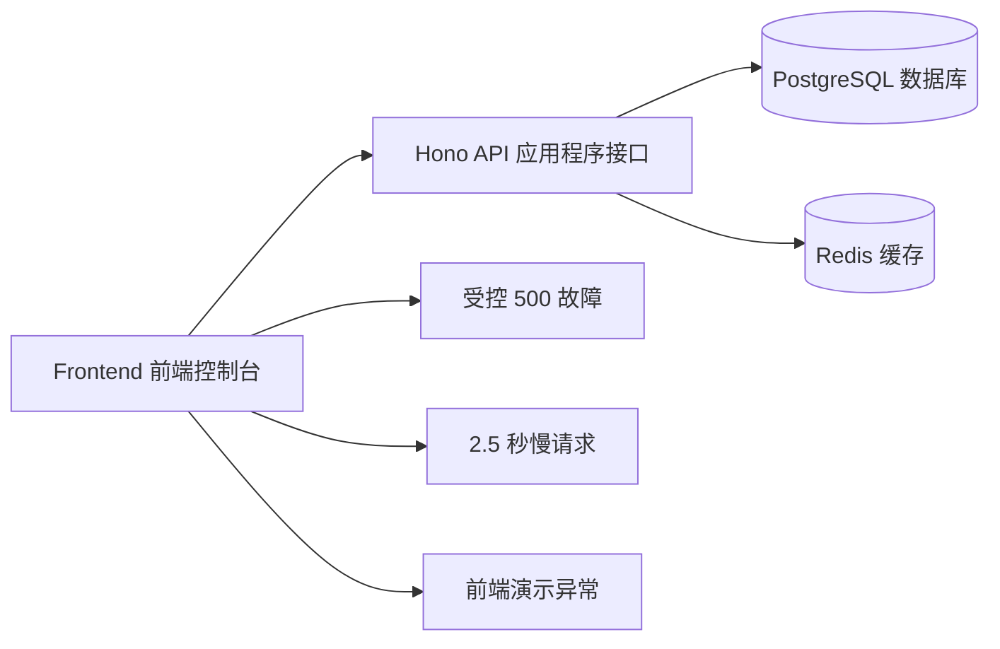

# M1 里程碑验收

日期：2026-06-07
状态：`accepted`
准入依据：[M1-milestone-acceptance.md §6 M2 准入](#6-m2-准入)

## 1. 验收结论

M1 最小业务系统的工程能力已经完成，可以进入 M2 可观测性基础闭环。

## 2. 任务状态

| 任务 | 结论 | 主要证据 |
|---|---|---|
| M1-01 技术栈确认 | 完成 | React + Vite + Hono + tRPC + PostgreSQL + Redis |
| M1-02 前端项目 | 完成 | 前端生产构建通过 |
| M1-03 后端项目 | 完成 | 后端服务可在 `8000` 端口启动 |
| M1-04 PostgreSQL | 完成 | orders（订单）表真实写入、读取和清理成功 |
| M1-05 Redis | 完成 | 缓存真实 set/get/delete（写入/读取/删除）成功 |
| M1-06 正常业务接口 | 完成 | 健康检查、订单创建、订单列表通过 |
| M1-07 后端 500 | 完成 | 返回 HTTP 500 和稳定错误码，不泄露堆栈 |
| M1-08 高延迟接口 | 完成 | 配置 2500 ms，实测 2.50 秒 |
| M1-09 前端故障按钮 | 完成 | 正常订单、500、慢请求、前端异常四个入口 |
| M1-10 总验收 | 完成 | 类型、测试、构建、数据库、缓存和容器门禁通过 |
| M1-11 双 Agent 冻结审计 | 完成 | ClaudeCode 实施审计、全新只读上下文独立测试、Codex 复核 |
| M1-12 M1 治理门禁 | 完成 | M1 路径限制、Stop 检查器和四项门禁单元测试 |

## 3. 验证证据

| 验证项 | 结果 |
|---|---|
| `pnpm check-types` | 通过，10 个 workspace（工作区）参与检查 |
| `pnpm test` | 通过，35/35 |
| `pnpm build` | 通过 |
| PostgreSQL 集成验证 | 通过，临时订单已清理 |
| Redis 集成验证 | 通过，临时缓存键已清理 |
| `docker compose ps` | PostgreSQL 16、Redis 7-alpine 均为 healthy（健康） |
| CORS（跨域资源共享） | `http://localhost:3001` 可访问后端 |

## 4. 工作流实测

M1-01、M1-04 至 M1-10 均经过活动任务、测试影响分析、证据、复核和归档。工作流成功阻止了不完整任务直接关闭，也暴露了以下真实问题：

- `@opsagent/db` 最初没有进入全仓类型检查。
- Node ESM（模块系统）验证脚本的扩展名和构建输出路径需要统一。
- 前端固定端口 `3001` 与后端 CORS（跨域资源共享）配置最初不一致。
- `tsx` 测试运行器在受限沙箱中需要临时 IPC（进程间通信）权限。

M1-11 首次跑通了真实双 Agent（智能体）闭环：

1. Codex 建立任务合同并通过消息总线派发。
2. ClaudeCode implementer（实施者）先执行 `/init` 更新 `CLAUDE.md`，再审计并修复通用 500 错误码。
3. 全新只读 ClaudeCode tester（测试者）独立执行类型检查、31 项测试、构建和差异检查。
4. Codex 登记测试证据并完成代码与文档复核。

本次实测还暴露并修复了 prompt（提示词）被 `--allowedTools` 可变参数吞掉的问题。Codex 宿主沙箱首次禁止读取 `~/.claude.json`，经明确授权后在沙箱外恢复执行；这与 ClaudeCode 的 dangerous mode（危险权限模式）属于两层不同的权限控制。

M1-12 验证了失败恢复能力。ClaudeCode implementer（实施者）完成主体门禁后超过 15 分钟执行超时，没有生成成功结果消息；Codex 审计其残留改动，发现测试文件位于测试脚本无法收集的子目录，于是修正测试位置并补充 Stop 命令链测试。随后全新只读 tester（测试者）确认：

- `@opsagent/workflow-gates` 28/28 通过，其中包含四项 M1 门禁测试。
- 全仓测试 35/35、类型检查 10/10、构建 5/5 通过。
- M1 Stop Hook（停止钩子）不再显示 `no strict checker yet; skipped`。
- M0 基础检查仍会先执行，随后执行 `pnpm check-types` 和 `pnpm test`。

最终人工复核还发现 `.claude/active-goal` 一度不存在：Codex 的持续 goal（目标）正常运行，但 ClaudeCode Hook（钩子）的阶段开关并未自动同步。创建本地 `active-goal=M1` 后，真实 Hook 验证通过：

- `stopCheck.ts` 完整通过 M1 严格检查。
- 写入 `observability/prometheus/prometheus.yml` 被 exit 2 阻断。
- 写入 `apps/backend/src/app.ts` 被正常放行。

因此当前 `/goal` 与 `.claude/active-goal` 仍是两个需要显式同步的状态源；后续应由 CLI 自动创建和关闭阶段文件。

## 5. 已知警告

| 警告 | 影响 | 后续 |
|---|---|---|
| 前端主 chunk（代码块）超过 500 kB | 不阻塞 M1 | 后续按路由和工具面板拆包 |
| tsdown（构建工具）的 `noExternal` 已弃用 | 不阻塞 M1 | 后续迁移到 `deps.alwaysBundle` |
| 内置浏览器实例不可用 | 缺少自动截图证据 | 当前以构建、API、响应式约束和人工访问验收 |
| Actor Runtime（执行者运行时）仅在结束时输出 JSON | 长任务中间状态不可见 | 后续改为 stream-json（流式 JSON）并记录阶段事件 |
| `.agent/` 使用普通 JSON 文件 | 并发执行可能覆盖状态 | 后续增加原子写和文件锁，或迁移数据库 |

## 6. M2 准入

M2 可以直接围绕现有三类故障入口增加结构化日志、指标和 Trace（链路追踪），不需要重新设计业务系统。
