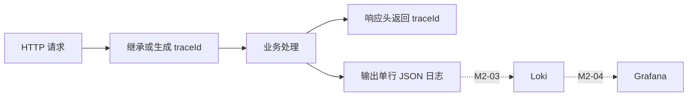

# M2-01 后端结构化请求日志

## 1. 目标

让 Backend（后端）为每个 HTTP 请求输出一条机器可解析的 JSON 日志，为后续 Loki（日志系统）采集、Grafana（可视化平台）查询和 Trace（链路追踪）关联建立数据基础。



M2-01 只负责让应用产生正确日志。Loki 的采集与 Grafana 页面不属于本任务。

## 2. 日志合同

| 字段 | 含义 |
|---|---|
| `timestamp` | ISO 8601 格式发生时间 |
| `level` | `INFO` 或 `ERROR` |
| `traceId` | 请求关联标识 |
| `method` | HTTP 方法 |
| `route` | 请求路径 |
| `statusCode` | HTTP 状态码 |
| `durationMs` | 请求耗时，单位毫秒 |
| `errorCode` | 错误请求的稳定业务错误码 |

示例：

```json
{"timestamp":"2026-06-06T14:36:30.874Z","level":"ERROR","traceId":"opsagent-...","method":"POST","route":"/api/demo/fail-500","statusCode":500,"durationMs":1,"errorCode":"DEMO_FORCED_FAILURE"}
```

## 3. traceId 规则

- 请求携带符合字符和长度约束的 `x-trace-id` 时继续使用。
- 未携带或值不合法时生成 `opsagent-<UUID>`。
- 响应头返回最终使用的 `x-trace-id`。
- 日志与响应使用同一个值，方便后续从页面跳到日志和链路。

## 4. 安全边界

结构化日志不记录：

- `authorization`
- `cookie`
- 请求体
- 异常堆栈
- 原始未知异常消息

已知异常和未知异常都只记录稳定 `errorCode`。这避免未来 Loki 自动收集 stdout/stderr 时意外保存密钥、用户数据或内部堆栈。

## 5. 测试证据

| 验证项 | 结果 |
|---|---|
| Backend（后端）测试 | 12/12 通过 |
| traceId 响应头 | 通过 |
| 合法 traceId 继承 | 通过 |
| 非法 traceId 替换 | 通过 |
| 400 / 500 稳定错误码 | 通过 |
| 未知异常脱敏 | 通过 |
| 全仓类型检查、测试和构建 | ClaudeCode tester（测试者）验证通过 |

日志出口使用可注入 `LogSink`（日志输出接口），测试直接解析 JSON，不依赖人工读取终端。

## 6. 工作流记录

1. Codex 建立 M2-01 任务合同和测试策略。
2. ClaudeCode implementer（实施者）在 15 分钟超时前留下主体实现，但没有生成成功结果消息。
3. Codex 审计残留改动，修复测试类型错误、增加 traceId 合法性校验，并移除可能泄露堆栈的 `console.error` 旁路。
4. 全新只读 ClaudeCode tester（测试者）完成独立验证，并将详细结果发送到 reviewer（审查角色）收件箱。

本次再次证明：当前消息总线可以传递完成结果，但 Actor Runtime（执行者运行时）在超时后还不会自动产生 `execution_timed_out` 消息。

