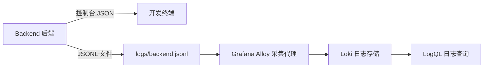

# M2-03 Loki 与 Grafana Alloy 日志闭环

## 目标

将 Backend（后端）的结构化 JSON 日志写入本地 JSONL 文件，由 Grafana Alloy（采集代理）持续读取并发送至 Loki（日志存储），最终可按 `traceId` 查询故障日志。



## 技术选择

| 组件 | 版本 | 选择理由 |
|---|---:|---|
| Loki | 3.7.2 | 当前稳定版本，单节点本地存储即可满足演示 |
| Grafana Alloy | 1.16.1 | Grafana 官方统一采集器，可替代已结束生命周期的 Promtail |

Promtail 已于 2026 年 3 月 2 日结束生命周期，因此新项目不再引入 Promtail。

## 实现

- `LOG_FILE_PATH` 未配置时，Backend 只输出控制台日志。
- 配置后，Backend 同时输出控制台日志和 JSONL 文件。
- `turbo.json` 将 `LOG_FILE_PATH` 加入 `dev.env`，避免 Turbo 严格环境变量模式过滤。
- Alloy 只读挂载仓库根目录 `logs/`，采集 `*.jsonl` 并写入 Loki。
- Loki 使用 TSDB（时序数据库）索引和 Docker volume（持久卷）保存数据。

开发命令在 `apps/backend` 目录执行，因此示例值为：

```dotenv
LOG_FILE_PATH=../../logs/backend.jsonl
```

## 真实闭环验收

2026 年 6 月 7 日执行：

```text
POST /api/demo/fail-500
x-trace-id: m2-03-loki-final
```

结果：

| 验收项 | 结果 |
|---|---|
| HTTP 状态码 | `500` |
| 稳定错误码 | `DEMO_FORCED_FAILURE` |
| 本地 JSONL | 找到 `m2-03-loki-final` |
| Loki ready | `HTTP 200 ready` |
| LogQL 查询 | 返回 1 条匹配日志 |
| Loki 标签 | `service_name=opsagent-backend` |

查询语句：

```logql
{service_name="opsagent-backend"} |= "m2-03-loki-final"
```

## 工作流记录

ClaudeCode（DeepSeek 模型）先承担实现，进程运行到 900 秒上限后被 Actor Runtime（执行者运行时）终止，未向消息总线发送完成消息。Codex 随后审计半成品、补齐测试并完成真实容器验收。

完成本地验收后，工作流再次启动全新只读 ClaudeCode tester（测试者）：

| 项目 | 结果 |
|---|---|
| 独立测试结论 | 全部标准通过，无缺陷 |
| Session ID（会话编号） | `d37a9d9f-a6ab-449c-9cf6-2d41b1434232` |
| 执行耗时 | `320196ms` |
| 模型成本 | `$2.191225` |
| 消息总线 | 生成 `execution_result`，Codex 已读取并归档 |

真实验收发现了单元测试未覆盖的问题：

```text
Turbo 未放行 LOG_FILE_PATH
  → Backend 只有控制台日志
  → Alloy 看不到文件
  → Loki 查询为空
```

修复 `turbo.json` 后闭环通过。这说明 M2 集成任务不能只依赖配置检查和单元测试。

另一个流程发现：`task:scope` 是整体覆盖命令，不是追加命令。扩大任务范围时必须重新传入完整范围清单。

## 已知边界

- 当前文件写入使用同步追加，适合本地演示；生产环境应使用异步日志库和缓冲策略。
- 当前是 Loki 单节点模式，不提供高可用和对象存储。
- Grafana 数据源与页面查询将在 M2-04 完成。

## 参考资料

- [Grafana Loki 发布记录](https://github.com/grafana/loki/releases)
- [Grafana Alloy 发布记录](https://github.com/grafana/alloy/releases)
- [Promtail 生命周期说明](https://grafana.com/docs/loki/latest/send-data/promtail/stages/replace/)
