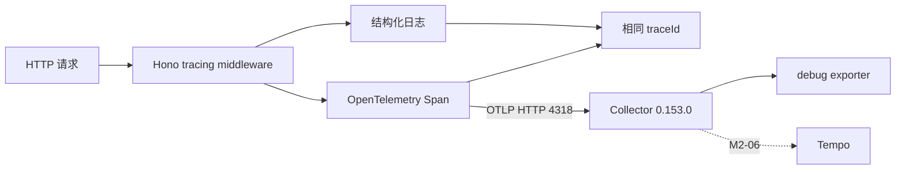

# M2-05 OpenTelemetry Collector 与后端 Trace

## 目标

让 Backend（后端）产生标准 OpenTelemetry Trace（链路追踪），通过 OTLP（可观测数据传输协议）发送给 Collector（采集器），并保证日志与 Span（链路片段）使用相同 traceId。



## 版本与端口

| 组件 | 版本或端口 | 用途 |
|---|---|---|
| OpenTelemetry Collector Contrib | `0.153.0` | 接收和处理 Trace |
| OTLP gRPC | `4317` | 标准 gRPC 接收端口 |
| OTLP HTTP | `4318` | Backend 当前使用的接收端口 |
| Health check | `13133` | Collector 健康检查 |

## 实现

- `tracing.ts` 为每个 Hono 请求创建服务端 Span。
- Span 包含 HTTP method、route、status code 和稳定错误码。
- tracing middleware 将标准 32 位十六进制 traceId 写入 Hono context。
- logger 优先复用该 traceId，因此日志、响应头与 Span 可以直接关联。
- Trace 通过 BatchSpanProcessor（批量处理器）发送到 Collector。
- Collector 暂时使用 debug exporter 输出详细 Span，M2-06 再接 Tempo。
- `OTEL_TRACES_ENABLED=false` 可以关闭导出；Collector 暂时不可用时不会阻断业务请求。

## 自动化验证

| 验证项 | 结果 |
|---|---|
| 原有后端测试 | 18/18 通过 |
| 新增 Trace 测试 | 2/2 通过 |
| 日志与 Span traceId 一致 | 通过 |
| 500 Span status | `ERROR` |
| 500 Span 稳定错误码 | `DEMO_FORCED_FAILURE` |
| 后端类型检查 | 通过 |
| Compose 配置展开 | 通过 |

## 工作流记录

M2-05 任务合同与测试共识创建完成后，Actor Runtime（执行者运行时）尝试调用 ClaudeCode（DeepSeek），但宿主安全策略拒绝向外部模型披露私有仓库上下文。Codex 未绕过策略，改为本地实现与验证。

拉取 `otel/opentelemetry-collector-contrib:0.153.0` 镜像时，宿主又因 Codex 使用额度触顶拒绝外部 Docker 操作。恢复时间提示为 2026 年 6 月 10 日 22:33。因此当前唯一未完成项是真实 Collector 容器接收 Span 的黑盒验收。

## 待执行黑盒验收

```bash
docker compose up -d otel-collector
pnpm dev:backend

curl http://localhost:8000/api/orders/health
curl -X POST http://localhost:8000/api/demo/fail-500

docker logs opsagent-otel-collector
```

预期 Collector 日志中出现两个 Span，并包含：

```text
service.name: opsagent-backend
http.response.status_code: 200 / 500
opsagent.error.code: DEMO_FORCED_FAILURE
```

## 已知边界

- 当前只创建 HTTP 请求级 Span，数据库和 Redis 子 Span 后续扩展。
- Collector 当前不持久化 Trace；M2-06 接入 Tempo。
- 生产环境应配置采样率、TLS（传输层安全）、认证和重试策略。

## 参考资料

- [OpenTelemetry Collector Releases](https://github.com/open-telemetry/opentelemetry-collector-releases/releases)
- [OpenTelemetry JavaScript](https://opentelemetry.io/docs/languages/js/)
