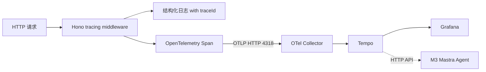

# M2-06 Jaeger / Tempo 链路追踪

日期：2026-06-09
状态：`planned`
前置任务：M2-01 / M2-02 / M2-03 / M2-04 / M2-05
依赖文档：
- [`test-discipline-checklist.md`](../workflows/test-discipline-checklist.md)（必须遵守）
- [`architecture-v3-candidacy.md`](../architecture/architecture-v3-candidacy.md)（V3 架构背景）

## 1. 目标

让 Backend 的 OpenTelemetry Trace 落库到可查询的链路追踪系统，让 M3 Mastra Agent 和人类都能按 `traceId` 查看完整 span 树。

## 2. 选型决策：Tempo 而不是 Jaeger

| 维度 | Jaeger | Tempo（✅ 选） |
|---|---|---|
| 与 Grafana 生态契合 | 独立，需要单独接入 | ✅ Grafana Labs 自家，原生集成 |
| 资源占用 | 较高（独立存储） | ✅ 较低（对象存储 + 只用 traceId 索引） |
| V3 架构契合 | 一般 | ✅ 与 Prometheus + Loki + Grafana 形成完整 Grafana 栈 |
| 与 M2-05 OTel Collector | 兼容 | ✅ 兼容，且更顺 |

**决策记录**：选 Tempo，记录在 commit message。

## 3. 十个开发维度

### 维度 1：选型 ✅

见第 2 节。

### 维度 2：基础设施

- `docker-compose.yml` 新增 `tempo` 服务（OTLP 端口 4317/4318，查询端口 3200）
- `observability/grafana/datasources/datasources.yml` 注册 Tempo 数据源
- `observability/otel/otel-collector-config.yaml` 把 traces exporter 从 `debug` 改为 `otlphttp/tempo`
- 启动验证：`docker compose config` 通过，`docker compose up -d` 后 Tempo target 状态为 `up`

### 维度 3：后端埋点

- M2-05 已引入 OTel SDK + tracing middleware，本任务**不需要**重复引入
- 检查现有 span 是否覆盖关键接口（订单创建、故障接口）
- 确认 trace context（W3C traceparent header）在中间件间正确传递
- 检查字符串硬编码：`SERVICE_NAME`、`OTEL_EXPORTER_ENDPOINT` 走 `constants/` 或 `env.ts`（AGENTS.md 禁止硬编码原则）

### 维度 4：日志与 Trace 联动

- 确认 M2-01 的 JSON 日志 traceId 格式与 Tempo 一致（W3C 32 位 hex）
- `observability/grafana/datasources/datasources.yml` Loki 数据源配置 `derivedFields`，让日志里的 traceId 可点击跳转到 Tempo

### 维度 5：指标与 Trace 联动

- Prometheus 指标加 exemplar，指向 traceId
- Grafana 看板里某个异常点可点击直达对应链路
- 若 M2-02 尚未支持 exemplar，本任务补充

### 维度 6：M3 Mastra Agent 衔接（V3 架构核心价值）⭐

- 后端新增 `/api/traces/:traceId` 代理接口，Mastra Agent 通过它查 Tempo（避免 Agent 直连 Tempo，安全 + 统一）
- 定义 Mastra Agent 调用 Tempo 的 schema（输入 traceId，输出 span 树）
- 在 `docs/architecture/` 记录"Mastra Agent 如何查 Trace"，为 M3 铺路

### 维度 7：验证与证据

- 手动验证：触发 500 故障 → Grafana Loki 看日志 → 点 traceId 跳 Tempo → 看完整 span 树
- 截图保存到 `docs/screenshots/`（为 M7 面试展示备料）

### 维度 8：治理与提交

- 当前分支 `qoder/workflow-v2-review` 是文档分支，**不在本分支做代码**
- 切回 `M2-06-edit-by-ClaudeCode` 分支做代码
- 把 V3 决策文档 merge 到 M2-06 分支，避免分叉
- 拆成 2-3 个提交：基础设施 → 后端埋点与 API → 测试与验证

### 维度 9：回归

- M2-01 日志不退化：加 traceId 后日志格式仍符合 M2-01 约定
- M2-02 指标不退化：exemplar 加入不影响现有 PromQL 查询
- M2-03 日志采集不退化：Alloy 仍能正常采集带 traceId 的 JSONL
- M2-04 Grafana 不退化：Prometheus + Loki 数据源仍然正常，新增 Tempo 数据源不冲突
- M2-05 Collector 不退化：Collector 接收 Span 并路由到 Tempo，原有 debug exporter 行为不被破坏

### 维度 10：测试（遵守 [`test-discipline-checklist.md`](../workflows/test-discipline-checklist.md)）

见第 4 节。

## 4. 测试影响分析

### 受影响的现有测试

| 测试文件 / 用例 | 动作 | 理由 |
|---|---|---|
| `apps/backend/src/__tests__/observability.tracing.test.ts`（M2-05 已有） | `update` | OTel Collector 路由到 Tempo 后，可能需要 mock Tempo 端点或跳过 exporter |
| `apps/backend/src/__tests__/api.*.test.ts`（M1 已有） | `none` | 业务接口行为不变 |
| `observability/otel/*` 配置校验测试（M2-05 已有） | `update` | exporter 配置从 debug 改为 otlphttp/tempo，断言需更新 |

### 新增测试

| 测试类型 | 测试文件 / 用例名 | 验证行为 |
|---|---|---|
| `integration` | `apps/backend/src/__tests__/api.traces-proxy.test.ts` - `should return span tree for valid traceId` | 后端 Tempo 代理 API 正确返回 span 树 |
| `integration` | `apps/backend/src/__tests__/api.traces-proxy.test.ts` - `should respond 404 for unknown traceId` | 后端 Tempo 代理 API 对不存在的 traceId 返回 404 |
| `integration` | `apps/backend/src/__tests__/api.traces-proxy.test.ts` - `should respond 503 when Tempo unavailable` | 后端 Tempo 代理 API 在 Tempo 不可用时优雅降级 |
| `e2e` | `e2e/trace-flow.test.ts` - `should complete full trace flow from fault to Tempo` | 触发故障 → 查代理 API → 断言 span 树存在 |
| `config` | `observability/grafana/datasources.test.ts` - `should provision Tempo datasource` | Grafana datasources.yml 配置校验 |

### 回归测试清单更新

- [ ] 把 `api.traces-proxy.test.ts` 加入 M3 启动时的回归测试清单
- [ ] 把 `trace-flow.test.ts` 加入 M2 验收时的回归测试清单

### 不写测试的理由

不适用（本任务涉及业务代码和配置改动，必须写测试）。

## 5. 验收标准

| 验收项 | 标准 |
|---|---|
| Tempo 启动 | `docker compose up -d tempo` 成功，3200 端口可访问 |
| Collector 路由 | Span 通过 Collector 落入 Tempo，不再只是 debug 输出 |
| Grafana Tempo 数据源 | Grafana 可查询 Tempo，target 状态 `up` |
| Loki → Tempo 跳转 | 日志里 traceId 可点击直达 Tempo 链路 |
| Prometheus → Tempo 跳转 | exemplar 可点击直达 Tempo 链路 |
| 后端代理 API | `/api/traces/:traceId` 正确返回 span 树 |
| 测试 | 第 4 节列出的所有测试通过 |
| 回归 | 第 9 节列出的所有回归检查通过 |
| 截图 | `docs/screenshots/m2-06-*.png` 至少 3 张 |

## 6. 提交计划

| 批次 | 提交信息 | 内容 |
|---|---|---|
| 1 | `feat(m2-06): add Tempo and route Collector traces to it` | Tempo 服务 + Grafana datasource + Collector exporter 配置 |
| 2 | `feat(m2-06): add backend Tempo proxy API for M3 Mastra Agent` | `/api/traces/:traceId` 代理 |
| 3 | `test(m2-06): add trace flow e2e and Tempo proxy integration tests` | 第 4 节列出的所有新增测试 |
| 4 | `docs(m2-06): add acceptance evidence and M3 integration notes` | 截图 + M3 衔接文档 |

## 7. 不做的事（边界）

- **不引入 Jaeger**：已决策用 Tempo
- **不在本任务做 M2-07 Dashboard**：Dashboard 是独立任务
- **不在本任务做 M2-08 SLO**：SLO 是独立任务
- **不动 v1 工作流源码**：本任务不涉及 `packages/workflow-gates/`
- **不在文档分支做代码**：代码在 `M2-06-edit-by-ClaudeCode` 分支

## 8. 与 V3 架构的关系

M2-06 是 V3 架构底层的"可观测栈"补全最后一环：

- ✅ M2-01 结构化日志（已有）
- ✅ M2-02 Prometheus（已有）
- ✅ M2-03 Loki + Alloy（已有）
- ✅ M2-04 Grafana datasources（已有）
- ✅ M2-05 OTel Collector（已有，待镜像验收）
- ⏳ **M2-06 Tempo（本任务）**

M2-06 完成后，M3 Mastra Agent 能读三种数据（指标 / 日志 / 链路），V3 产品本体能力成立。
