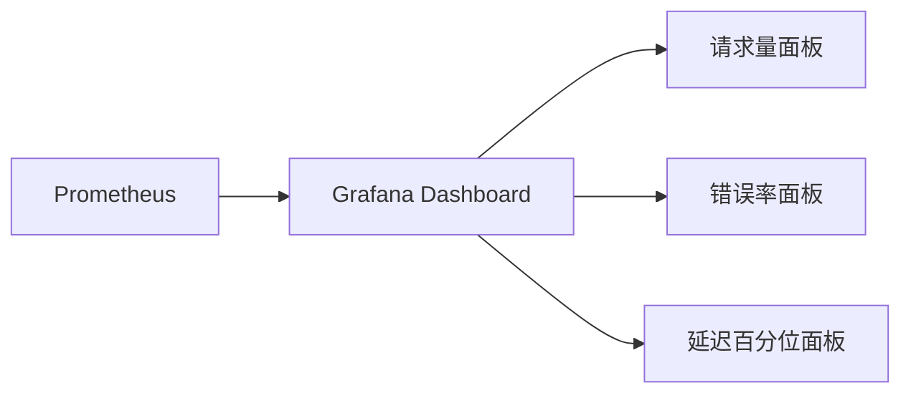

# M2-07 Grafana 基础 Dashboard

日期：2026-06-09
状态：`done`
前置任务：M2-01 / M2-02 / M2-03 / M2-04

## 1. 目标

提供一个开箱即用的 Grafana 看板，展示后端请求量、错误率和延迟，让 M3 Mastra Agent 和人类运维都能快速了解系统健康状态。

## 2. 交付物

| 文件 | 说明 |
|---|---|
| `observability/grafana/dashboards/backend-overview.json` | 看板 JSON，包含 8 个面板 |
| `observability/grafana/provisioning/dashboards/dashboards.yml` | Dashboard provisioning 配置 |
| `docker-compose.yml` Grafana volumes | 新增 dashboards 和 provisioning 挂载 |

## 3. 面板清单

| 面板 | 类型 | PromQL | 单位 |
|---|---|---|---|
| Total Requests | stat | `sum(increase(http_requests_total[30m]))` | short |
| Error Count (5xx) | stat | `sum(increase(http_requests_total{status_code=~"5.."}[30m]))` | short |
| Error Rate | stat | `sum(rate(...5xx)) / sum(rate(...)) * 100` | percent |
| P95 Latency | stat | `histogram_quantile(0.95, ...)` | seconds |
| Request Rate | timeseries | `sum(rate(...)) by (method, route)` | reqps |
| Error Rate Over Time | timeseries | 同 Error Rate | percent |
| Latency Percentiles | timeseries | P50 / P95 / P99 | seconds |
| Request Rate by Status Code | timeseries | `sum(rate(...)) by (status_code)` | reqps |

## 4. 验收标准

| 验收项 | 标准 |
|---|---|
| Dashboard provisioning | Grafana 启动后自动加载看板 |
| 面板数据 | 后端发请求后所有面板有数据 |
| 时间范围 | 默认 30 分钟，10 秒自动刷新 |

## 5. 不做的事（边界）

- 不做告警规则（M6 稳定性工程）
- 不做 Loki 日志面板（Loki Explore 够用）
- 不做 Tempo 链路面板（Tempo Explore 够用）
