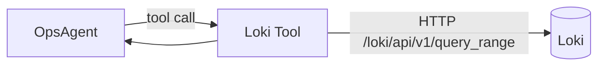

# M3-05 Loki Tool

日期：2026-06-11
状态：`done`（提交 `309012d`）
前置任务：M3-01 / M2-03
负责人：ai-agent-team

## 1. 目标

为 Agent 提供查询 Loki 日志的 Tool，使智能体可以按时间窗口与标签拉取错误日志，作为 Incident Report 的证据。



## 2. 预期输入

| 字段 | 类型 | 必填 | 说明 |
|---|---|---|---|
| `query` | string | 是 | LogQL 表达式 |
| `start` | string | 否 | ISO 8601，默认 1 小时前 |
| `end` | string | 否 | ISO 8601，默认当前 |
| `limit` | number | 否 | 默认 100，最大 1000 |

## 3. 预期输出

标准化日志条目：

```json
{
  "timestamp": "2026-06-10T08:00:00Z",
  "line": "{\"level\":\"ERROR\", ...}",
  "labels": { "job": "backend" }
}
```

## 4. 交付物

| 文件 | 说明 |
|---|---|
| `apps/agent/src/tools/loki-tool.ts` | Tool 实现 |
| `apps/agent/src/tools/loki-tool.test.ts` | mock fetch 覆盖查询与错误 |
| `apps/agent/src/tools/index.ts` | 注册到 Agent |

## 5. 验收标准

| 验收项 | 标准 |
|---|---|
| LogQL 可执行 | 查询 `{job="backend"} \| json \| level="ERROR"` 返回结果 |
| 时间窗口 | `start` / `end` 正确传递到 Loki |
| 端点可配置 | 通过 `LOKI_URL` 环境变量注入 |
| 错误处理 | Loki 不可达时返回结构化错误 |

## 6. 不做的事（边界）

- 不做日志聚合或预处理（Agent 自己分析原文）。
- 不做租户隔离（Loki 当前为单租户）。
