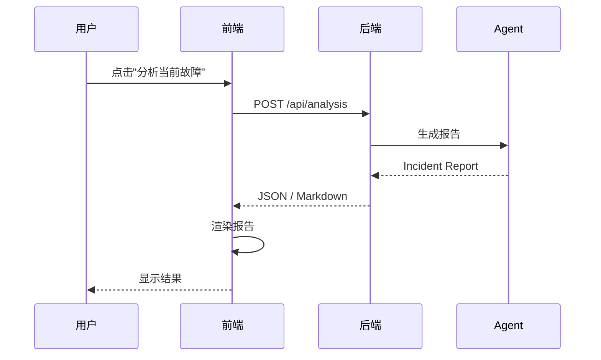

# M3-09 前端展示 AI 分析结果

日期：2026-06-11
状态：`done`（提交 `0020590`）
前置任务：M3-08 / 后端分析报告接口
负责人：frontend-team

## 1. 目标

在前端页面展示 Agent 生成的 Incident Report，使演示者可以"一键触发故障 → 一键查看 AI 分析"。

## 2. 交互流程

## 3. 交付物

| 文件 | 说明 |
|---|---|
| `apps/frontend/src/components/AnalysisReport.tsx` | 报告展示组件 |
| `apps/frontend/src/pages/DemoPage.tsx` | 集成触发按钮与结果区域 |
| `apps/frontend/src/api/analysis.ts` | 与后端对接的 fetch 封装 |

## 4. 验收标准

| 验收项 | 标准 |
|---|---|
| 触发按钮 | 页面存在"AI 分析"按钮 |
| 加载状态 | 请求中显示 loading |
| 错误处理 | 失败时显示错误而非空白 |
| Markdown 渲染 | 报告结构（标题、代码块、列表）正确呈现 |
| 响应式 | 在 1280px 宽度下不破坏布局 |

## 5. 不做的事（边界）

- 不做历史报告列表（M6）。
- 不做报告导出（M7 面试展示阶段）。
