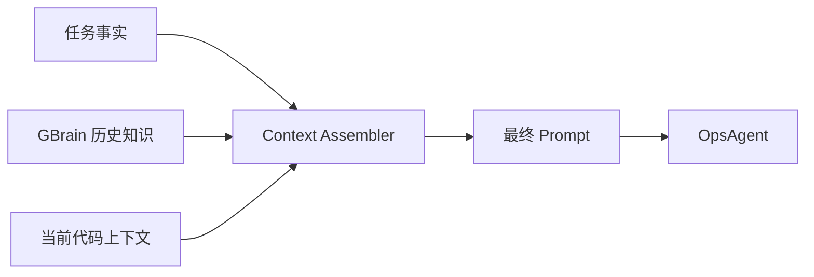

# M3-14 Agent 执行前 RAG

日期：2026-06-11
状态：`done`
前置任务：M3-13
负责人：ai-agent-team

## 1. 目标

在 Agent 执行任何分析任务前，自动从 GBrain 检索相关历史知识并拼接到 prompt 上下文，使报告可以引用"过去的决策 / 类似故障的经验"。

## 2. 上下文组装

## 3. 来源边界

| 来源 | 用途 | 不负责 |
|---|---|---|
| PostgreSQL 任务表 | 当前任务状态、验收标准 | 语义检索 |
| GBrain | 架构决策、工作流、故障经验 | 任务状态事实 |
| CodeGraph | 当前源码符号与调用关系 | 历史知识 |

## 4. 交付物

| 文件 | 说明 |
|---|---|
| `apps/agent/src/rag/context-assembler.ts` | 上下文组装逻辑 |
| `apps/agent/src/rag/retrieval-strategy.ts` | 检索策略（关键词 + 向量混合） |
| `apps/agent/src/rag/context-assembler.test.ts` | 覆盖多来源拼接与去重 |

## 5. 验收标准

| 验收项 | 标准 |
|---|---|
| 任务事实 | 当前任务的状态与验收标准自动注入 |
| 历史知识 | GBrain top-K 结果带 sourceId 注入 |
| 代码上下文 | 关键文件/符号注入且来源清晰 |
| 边界清晰 | 每个片段带 `source` 标签，不混淆 |

## 6. 不做的事（边界）

- 不做在线学习（只检索不微调）。
- 不做 prompt 压缩（超过 token 上限时直接截断并标记）。
