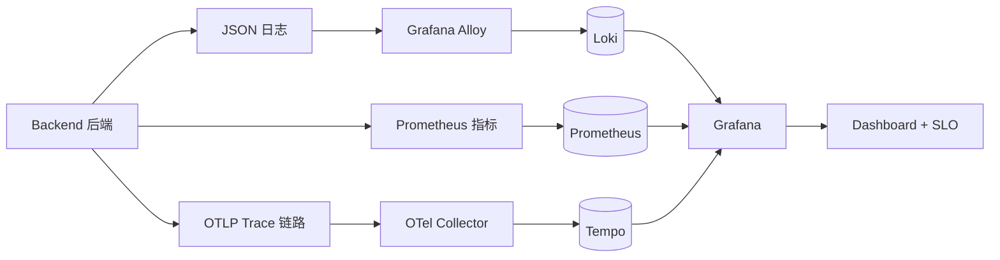

# M2 里程碑验收

日期：2026-06-09
状态：`accepted`
准入依据：[[M1/milestone-acceptance|M1-milestone-acceptance.md]] §6 M2 准入

## 1. 验收结论

M2 可观测性基础闭环已经完成，可以进入 M3 Mastra Agent 分析闭环。

## 2. 任务状态

| 任务 | 结论 | 主要证据 |
|---|---|---|
| M2-01 后端结构化日志 | 完成 | JSON 日志含 `traceId` / 接口 / 状态码 / 耗时 / 错误码，12/12 测试通过 |
| M2-02 Prometheus 指标 | 完成 | Prometheus Target 为 `up`，可查 200 与 500 请求指标（提交 `150018d`） |
| M2-03 Loki + Alloy 日志 | 完成 | JSONL → Alloy → Loki 链路，可按 `traceId` 查询 500 日志（提交 `c6a74c2`） |
| M2-04 Grafana 数据源 | 完成 | provisioning 自动注册 Prometheus 与 Loki，默认语言中文（提交 `f7e5016`） |
| M2-05 OpenTelemetry Collector | 完成 | OTLP/HTTP 接收 Trace，debug + otlp_http 双导出，健康检查通过（提交 `33271b4`） |
| M2-06 Tempo 持久化 Trace | 完成 | OTel → Tempo 链路 + `GET /api/traces/:traceId` 代理端点，23/23 测试通过（提交 `34e98f8`） |
| M2-07 Grafana Dashboard | 完成 | 8 个面板：请求量 / 错误数 / 错误率 / P95 stat + 时序 + 延迟分位 + 状态码分布（提交 `34e98f8`） |
| M2-08 SLO 配置草案 | 完成 | `observability/slo.yml`：可用性 99.9%、P95<500ms、P99<2000ms，演示接口已排除 |

## 3. 验证证据

| 验证项 | 结果 |
|---|---|
| `pnpm check-types` | 通过 |
| `pnpm test` | 通过，含 M2-06 新增 23 项测试 |
| `docker compose ps` | Prometheus / Loki / Alloy / Grafana / OTel Collector / Tempo 全部 healthy |
| `docker compose config` | 通过 |
| Grafana 看板 | 默认数据源 Prometheus，可在浏览器查看指标面板 |
| Loki 查询 | 按 `traceId` 可定位 500 错误日志 |
| Tempo 查询 | 通过后端 `/api/traces/:traceId` 可取回 span 树 |

## 4. 工作流记录

M2 全程按"任务卡 → 实施 → 独立测试 → 提交关联任务号"推进。关键节点：

1. M2-01 ~ M2-05 逐个落地，每一步都有手动验证记录。
2. M2-06 首次引入测试纪律清单（`docs/workflows/test-discipline-checklist.md`），补齐了失败路径、并发与错误码维度。
3. 提交 `eda9f1d`：M2 收官复盘 + M3 评估 + M4 新增 OTel Web SDK 任务。
4. 提交 `34e98f8`：M2 最终收官，M2-06/07/08 与 Trace 代理端点一次性合入。

期间还沉淀了 workflow v2 设计草案（`docs/archive/workflow-v2-design.md`）与评审意见（`docs/archive/workflow-v2-review-comments.md`），并最终决定 workflow v2 冻结、转向 OpenHands 评估方向（`docs/architecture/architecture-v3-candidacy.md`）。这些讨论与 M2 代码改动解耦，不影响 M2 验收。

## 5. 已知警告

| 警告 | 影响 | 后续 |
|---|---|---|
| Grafana Dashboard 为基础草案 | 不含业务指标与告警 | M6 稳定性工程增强 |
| SLO 配置为草案 | 未绑定 alerting rules | M6 |
| OTel Collector 仅 debug + otlp_http | 未做采样与远端转发策略 | M6 |
| Tempo 当前为本地演示规模 | 未做分片与持久化调优 | M6 |
| 前端 OTel Web SDK 未接入 | Trace 只能从后端发起 | M4 新增任务 |

## 6. M3 准入

M3 可以直接围绕以下能力展开：

- Mastra Agent 骨架（M3-01 ~ M3-03）已具备启动条件。
- Prometheus / Loki / Tempo 三个 Tool（M3-04 ~ M3-06）的数据源都已在 M2 就绪。
- GBrain + RAG 系列（M3-11 ~ M3-16）依赖本地 pgvector，需在 M3-11 启动前确认环境可用。

M2 期间只记录 GBrain 方案，未提前迁移文档或接入 MCP，避免扩大里程碑范围（提交 `eda9f1d` 确认）。
