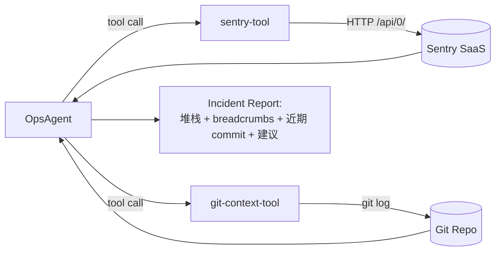

# M4-09 Agent 结合源码给建议（sentry-tool）

日期：2026-06-16
状态：`planned`
前置任务：M4-04（Source Map 上传，提供已 symbolicated 的堆栈）/ M3-07（git-context-tool，提供近期源码变更）
负责人：ai-agent-team

## 1. 目标

为 OpsAgent 增加一个 **sentry-tool**，让 Agent 能主动查询 Sentry SaaS 上最近的前端 error event（堆栈 + breadcrumbs + 环境信息），结合现有 git-context-tool 给出"哪行代码 + 哪个 commit 可能引入 bug"的建议，覆盖 **前端错误 → 源码定位 → 修复建议** 的闭环。



## 2. 预期输入

### 2.1 Tool 的 inputSchema（Agent 调用时传）

| 字段 | 类型 | 必填 | 说明 |
|---|---|---|---|
| `issueId` | string | 否 | 指定查某个 Issue 的最新 event；不传则列出最近 N 个 unresolved Issue |
| `query` | string | 否 | Sentry 搜索语法（如 `is:unresolved level:error`），默认 `is:unresolved` |
| `limit` | number | 否 | 列表返回条数，默认 5，最大 20 |

### 2.2 环境变量（`@opsagent/env` server schema）

复用 M4-04 的 `SENTRY_AUTH_TOKEN` / `SENTRY_ORG` / `SENTRY_PROJECT`（不新增凭证）：

| 字段 | 用途 |
|---|---|
| `SENTRY_AUTH_TOKEN` | Bearer token，鉴权 Sentry REST API |
| `SENTRY_ORG` | URL path 中的 `{org}`（如 `none-fez`） |
| `SENTRY_PROJECT` | URL path 中的 `{project}`（如 `javascript-react`） |

## 3. 预期输出

### 3.1 列 Issue（不传 issueId 时）

```json
{
  "status": "success",
  "issues": [
    {
      "id": "12345",
      "title": "TypeError: Cannot read 'total' of null",
      "culprit": "Checkout.tsx in handleSubmit at line 137",
      "count": "42",
      "firstSeen": "2026-06-15T10:00:00Z",
      "lastSeen": "2026-06-16T08:30:00Z"
    }
  ]
}
```

### 3.2 取单个 Issue 最新 event（传 issueId 时）

```json
{
  "status": "success",
  "event": {
    "issueId": "12345",
    "title": "TypeError: Cannot read 'total' of null",
    "platform": "javascript",
    "timestamp": "2026-06-16T08:30:00Z",
    "stacktrace": [
      {
        "filename": "apps/frontend/src/pages/Checkout.tsx",
        "lineNo": 137,
        "colNo": 24,
        "function": "handleSubmit",
        "inApp": true
      }
    ],
    "breadcrumbs": [
      { "type": "navigation", "message": "/cart → /checkout", "timestamp": "..." },
      { "type": "ui.click", "message": "button#submit-order", "timestamp": "..." }
    ],
    "contexts": {
      "browser": { "name": "Chrome", "version": "126.0" },
      "os": { "name": "macOS", "version": "14.5" }
    }
  }
}
```

> Source Map 已经在 M4-04 上传，Sentry 返回的 `stacktrace.frames` 是**已 symbolicated** 的源码位置，agent 直接拿就行，不需要额外反解。

## 4. 交付物

| 文件 | 说明 |
|---|---|
| `apps/agent/src/tools/constants.ts` | 追加 `SENTRY_TOOL` 常量（ID / DESCRIPTION / API_PATH / TIMEOUT_MS / ERROR codes） |
| `apps/agent/src/tools/sentry-tool.ts`（新建） | `SentryDeps` 接口 + `createSentryTool` 工厂；用 `fetch` 直调 Sentry REST API |
| `apps/agent/src/tools/sentry-tool.test.ts`（新建） | mock fetch 覆盖：成功 list / 成功 get event / 401 错误 / 空结果 / 超时 |
| `apps/agent/src/tools/index.ts` | `createDefaultTools()` 追加 `createSentryTool()` + export `createSentryTool` |
| `apps/agent/src/analysis-pipeline.ts` | `ANALYSIS_INSTRUCTIONS` 追加"前端错误分析"指令（§6） |
| `apps/agent/src/tools/constants.test.ts`（可选） | 验证 `SENTRY_TOOL` 常量完整性 |

## 5. 验收标准

| 验收项 | 标准 |
|---|---|
| Tool 注册 | `createDefaultTools()` 返回 5 个 tool（+sentry），agent 能识别 `sentry` 工具名 |
| List 模式 | `agent.generate("列出最近的前端错误")` → 调用 `sentry` tool → 返回 Issue 列表（不传 issueId） |
| Get 模式 | `agent.generate("分析 issue 12345")` → 调用 `sentry` tool（传 issueId）→ 返回堆栈 + breadcrumbs |
| 联合分析 | Agent 报告同时包含 Sentry 堆栈 + git-context 的近期 commit（说明 ANALYSIS_INSTRUCTIONS 引导成功） |
| 错误处理 | Sentry 不可达 / 401 / 404 / 超时 → tool 返回结构化错误，不抛异常，agent 继续分析其他证据 |
| 凭证安全 | `grep -r SENTRY_AUTH_TOKEN apps/agent/dist/` 无输出；token 只在 server 端使用 |
| 类型检查 | `pnpm --filter @opsagent/agent check-types` 0 errors |
| 单元测试 | `sentry-tool.test.ts` 覆盖 5 个场景（list / event / 401 / 空 / 超时） |
| 端到端 | 手动触发前端异常 → Sentry 捕获 → 调 `pnpm task:analyze` → Incident Report 出现"前端错误"章节 + 源码文件 + 行号 |

## 6. Agent Instructions 增量（草稿）

追加到 `ANALYSIS_INSTRUCTIONS` 现有 §1 工具清单：

```
- **sentry**：查询 Sentry 前端错误（Issue 列表 + 单个 Issue 的最新 event）。
  返回已 symbolicated 的堆栈（源码文件 + 行号）+ breadcrumbs（用户操作轨迹）。
  分析前端错误时，先查 sentry 拿堆栈位置，再用 git-context 查该文件近期 commit，
  推断"哪个提交可能引入的 bug"。
```

追加到 §2 "报告章节"：

```
- 报告新增"前端错误"章节：Sentry Issue 标题 + 堆栈 + breadcrumbs + 影响用户数
```

## 7. 不做的事（边界）

- **不做** Release 趋势查询 / issue 历史统计（增强版留到 M6）
- **不做** GlitchTip API 适配（M4 专注 Sentry SaaS，GlitchTip 留到 M4 Phase D）
- **不做** Source Map 自研反解（那是 M4-07 的范围）
- **不做** Sentry session replay 拉取（数据量大，超出最小可用范围）
- **不做** 写 Sentry 的 API（如更新 issue 状态 / 加评论）——Agent 当前只读

## 8. Sentry REST API 关键 endpoint

| 用途 | 路径 | 文档 |
|---|---|---|
| 列 Issue | `GET /api/0/projects/{org}/{project}/issues/` | https://docs.sentry.io/api/issues/list-a-projects-issues/ |
| 取 Issue 最新 event | `GET /api/0/issues/{issueId}/events/latest/` | https://docs.sentry.io/api/events/retrieve-an-event-for-a-project/ |
| 取 Issue 详情 | `GET /api/0/issues/{issueId}/` | https://docs.sentry.io/api/issues/retrieve-an-issue/ |

鉴权：HTTP header `Authorization: Bearer <SENTRY_AUTH_TOKEN>`

## 9. 测试证据（完工后填写）

> 实施阶段补：mock fetch 测试报告 + agent.generate 端到端 + Sentry Dashboard 截图。

## 10. 工作流记录（完工后填写）

> 实施阶段补：每步 commit sha、遇到的意外、决策变更。

## 反向引用

- [[0006-sentry-release-sourcemap-strategy|ADR-0006]]：§4 凭证管理（sentry-tool 复用同一 token）
- [[planning|M4 规划]]：§3.5 任务细化（M4-09 的 tool 伪代码出处）
