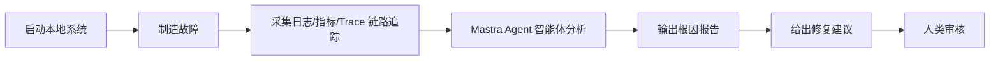
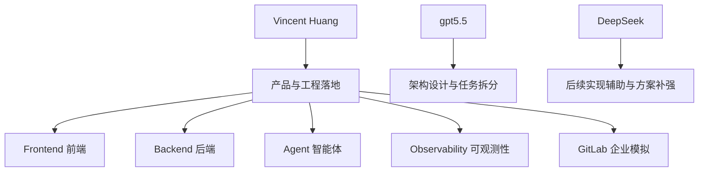
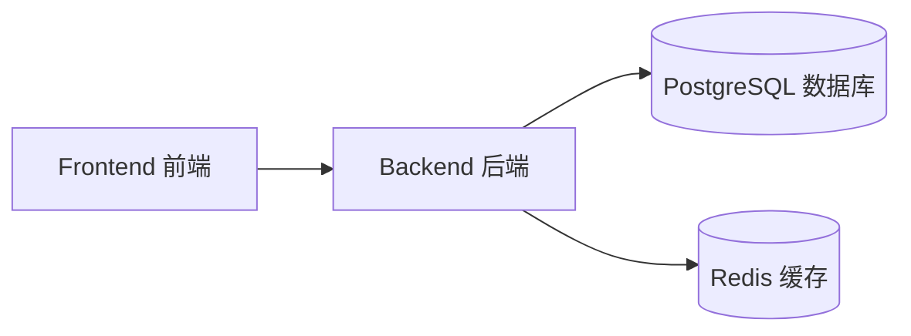
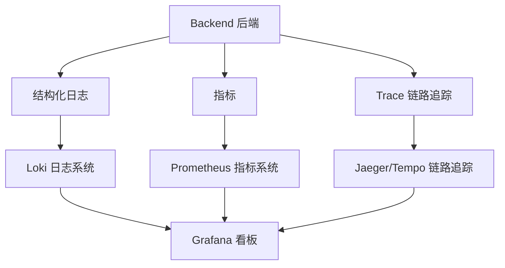
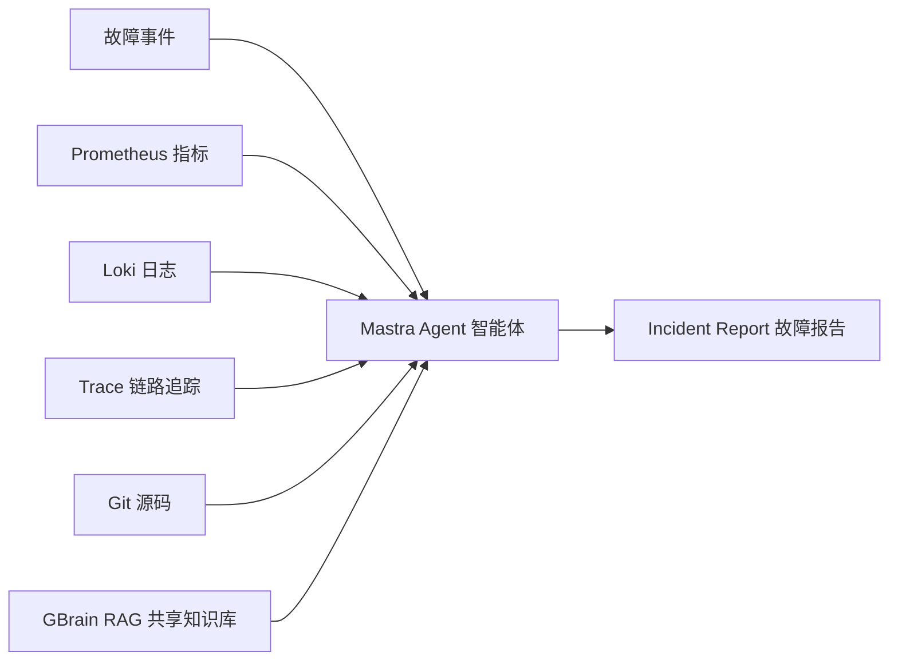
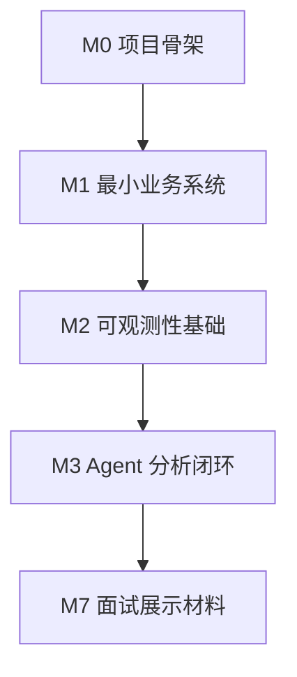
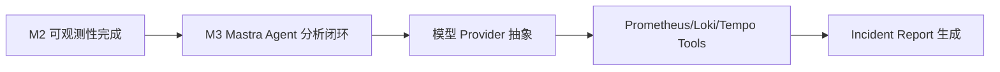

# OpsAgent 任务拆分

本文档是 OpsAgent v0.1 的正式任务拆分。目标是把规划文档里的 AI Ops（智能运维）愿景拆成可以逐步实现、可以提交、可以验收的工程任务。

执行这些任务时，统一参考 [docs/workflows/agent-execution-workflow.md](workflows/agent-execution-workflow.md)，用 `/goal`、hooks（钩子）和门禁约束 Agent（智能体）按流程完成。

## 1. v0.1 目标

v0.1 不追求一次性做完企业级全量能力，而是先做出一个完整闭环：

v0.1 验收标准：

| 验收项 | 标准 |
|---|---|
| 一键启动 | `docker compose up -d` 可以启动核心依赖 |
| 前后端可访问 | 前端页面和后端 API（应用程序接口）可本地访问 |
| 故障可制造 | 至少有 3 个故障演示入口 |
| 数据可观测 | 日志、指标、Trace（链路追踪）至少打通 2 类 |
| Agent 可分析 | Mastra Agent（智能体）可以读取观测数据并输出报告 |
| 模型可降级 | 支持 `openai`、`ollama`、`mock` 三种模式 |
| 文档可讲解 | README（项目说明）和 docs（文档）能支撑面试讲解 |

## 2. 分工模型

当前实际由一个人开发，但按真实企业团队边界拆任务。

逻辑团队：

| 团队 | 负责范围 |
|---|---|
| frontend-team | 前端页面、故障按钮、报告展示、前端错误上报 |
| backend-team | API（应用程序接口）、业务故障、日志、Trace（链路追踪）埋点 |
| ai-agent-team | Mastra（智能体框架）、Tools（工具调用）、Workflow（工作流）、模型降级 |
| sre-team | Docker Compose（容器编排）、Prometheus（指标）、Loki（日志）、Grafana（看板）、GitLab（代码托管） |
| qa-team | 测试计划、自动化测试、失败路径、回归检查、测试证据 |
| docs-team | README（项目说明）、架构图、面试讲稿、Runbook（处置手册） |

## 3. Milestone 规划

| Milestone | 中文目标 | 建议优先级 |
|---|---|---:|
| M0 | 项目骨架与治理文件 | P0 |
| M1 | 最小业务系统 | P0 |
| M2 | 可观测性基础闭环 | P0 |
| M3 | Mastra Agent 分析闭环 | P0 |
| M4 | Source Map 前端源码定位 | P1 |
| M5 | GitLab 企业模拟模式 | P1 |
| M6 | 稳定性工程增强 | P1 |
| M7 | 面试展示材料 | P0 |

优先级说明：

| 优先级 | 含义 |
|---|---|
| P0 | v0.1 必须完成 |
| P1 | v0.1 加分项，尽量完成 |
| P2 | 未来展望，暂不阻塞 v0.1 |

## 4. M0 项目骨架与治理文件

目标：让仓库先像一个正规项目。

闭环文档：[docs/issues/M0-project-scaffold.md](issues/M0-project-scaffold.md)

| 任务 ID | 任务 | 负责人 | 优先级 | 交付物 | 验收标准 |
|---|---|---|---:|---|---|
| M0-01 | 创建目录结构 | sre-team | P0 | `apps/frontend/`、`apps/backend/`、`apps/agent/`、`packages/shared/`、`observability/`、`docs/` | 目录存在，README（项目说明）一致 |
| M0-02 | 增加 `.gitignore` | sre-team | P0 | `.gitignore` | 忽略 `node_modules`、`.env`、构建产物、日志 |
| M0-03 | 增加 `.env.example` | sre-team | P0 | `.env.example` | 包含模型、数据库、端口、GitLab 配置示例 |
| M0-04 | 增加 `package.json`、`pnpm-workspace.yaml`、`turbo.json` | sre-team | P0 | Monorepo（单仓多项目）基础配置 | 根目录能运行统一脚本 |
| M0-05 | 增加 `packages/shared` 最小 TypeScript 包 | sre-team | P0 | 共享类型包 | `pnpm build` 能构建 |
| M0-06 | 增加基础 `docker-compose.yml` | sre-team | P0 | PostgreSQL、Redis | `docker compose config` 通过 |
| M0-07 | 增加 `CODEOWNERS` | docs-team | P1 | `CODEOWNERS` | 能体现 frontend/backend/agent/observability ownership（责任归属） |
| M0-08 | 增加 `docs/team-ownership.md` | docs-team | P1 | 团队责任说明 | 能解释当前个人项目如何模拟团队边界 |
| M0-09 | better-t-stack 技术试验 | sre-team | P1 | spike 结论 | 记录采用/不采用哪些结构 |
| M0-10 | 增加 CodeGraph 初始化说明 | docs-team | P1 | CodeGraph 说明 | 说明何时初始化和如何使用 |
| M0-11 | 增加 TypeScript 工作流门禁 | sre-team | P0 | `packages/workflow-gates` | Hook（钩子）可以执行确定性检查 |
| M0-12 | 增加角色与测试治理 | qa-team | P0 | 角色策略和测试共识协议 | 实现者不能单方面降低测试标准 |
| M0-13 | 增加任务交接 CLI | sre-team | P0 | 状态机、交接、证据和归档命令 | 非法状态跳跃被阻断 |
| M0-14 | 增加 Orchestration Assistant 编排助手 | ai-agent-team | P0 | 组合命令和 Execution Brief（执行简报） | 能输出当前模型、下一模型、命令和提示词 |
| M0-15 | 增加 Actor Runtime 执行者运行时 | ai-agent-team | P0 | 执行者注册表和 Claude Code Adapter（适配器） | 能按角色权限调用本机 Claude Code + DeepSeek 并保存审计结果 |
| M0-16 | 增加 Agent Message Bus 智能体消息总线 | ai-agent-team | P0 | 收件箱、发件箱、回复和归档 CLI（命令行工具） | Codex 和 Claude Code 能通过任务消息完成异步协商 |
| M0-17 | 执行 M0 Milestone Acceptance（里程碑验收） | sre-team + qa-team | P0 | 验收记录、验证证据和 M1 准入结论 | M0-01 至 M0-16 状态明确，核心门禁通过，遗留风险已记录 |

## 5. M1 最小业务系统

目标：先有一个能制造故障的业务系统。

| 任务 ID | 任务 | 负责人 | 优先级 | 交付物 | 验收标准 |
|---|---|---|---:|---|---|
| M1-01 | 选择前后端技术栈 | Vincent Huang | P0 | 技术选型记录 | 明确 React/Vite 或 Next.js，后端 Node/NestJS 或 FastAPI |
| M1-02 | 搭建前端项目 | frontend-team | P0 | `frontend/` | 本地可以启动页面 |
| M1-03 | 搭建后端项目 | backend-team | P0 | `backend/` | 本地可以访问健康检查 API |
| M1-04 | 接入 PostgreSQL | backend-team | P0 | 数据库连接配置 | 后端能读写一个 demo 表 |
| M1-05 | 接入 Redis | backend-team | P1 | 缓存连接配置 | 后端能写入和读取缓存 |
| M1-06 | 实现正常业务接口 | backend-team | P0 | `GET /api/orders/health` 或类似接口 | 返回正常 JSON（结构化数据） |
| M1-07 | 实现后端 500 故障接口 | backend-team | P0 | `POST /api/demo/fail-500` | 调用后产生可捕获异常 |
| M1-08 | 实现高延迟故障接口 | backend-team | P0 | `GET /api/demo/slow` | 调用后延迟超过阈值 |
| M1-09 | 前端增加故障按钮 | frontend-team | P0 | 故障演示页面 | 可以点击触发 500、慢请求、前端异常 |
| M1-10 | 执行 M1 Milestone Acceptance（里程碑验收） | sre-team + qa-team | P0 | 验收记录、验证证据和 M2 准入结论 | M1-01 至 M1-09 状态明确，业务与故障闭环通过 |
| M1-11 | 执行双 Agent（智能体）冻结审计 | ClaudeCode + Codex | P0 | 实施审计、独立测试报告和消息总线证据 | `/init`、实施、只读测试、复核闭环真实运行 |
| M1-12 | 补齐 M1 阶段路径与 Stop Hook（停止钩子）门禁 | ClaudeCode + Codex | P0 | `rules/m1.ts`、门禁测试和失败恢复记录 | M1 越界路径被阻断，Stop 不再跳过，M0 无回归 |

## 6. M2 可观测性基础闭环

目标：让故障被系统看见。

| 任务 ID | 任务 | 负责人 | 优先级 | 状态 | 交付物 | 验收标准 |
|---|---|---|---:|---|---|---|
| [M2-01](issues/M2-01-structured-logging.md) | 后端输出结构化日志 | backend-team | P0 | `done` | JSON 日志 | 日志包含 `traceId`、接口、状态码、耗时和稳定错误码 |
| [M2-02](issues/M2-02-prometheus-metrics.md) | 增加 Prometheus 配置 | sre-team | P0 | `done` | `observability/prometheus/` | Prometheus 可以启动，Target 状态为 `up`，可查询 200 与 500 请求指标 |
| [M2-03](issues/M2-03-loki-alloy-logging.md) | 增加 Loki 配置 | sre-team | P0 | `done` | `observability/loki/`、`observability/alloy/` | Alloy 采集 JSONL，Loki ready，可按 `traceId` 查询 500 日志 |
| [M2-04](issues/M2-04-grafana-datasources.md) | 增加 Grafana datasource | sre-team | P0 | `done` | `observability/grafana/datasources/` | Grafana 自动接入 Prometheus 和 Loki，provisioning 注册数据源 |
| [M2-05](issues/M2-05-opentelemetry-collector.md) | 增加 OpenTelemetry Collector | sre-team | P1 | `done` | `observability/otel/`、Backend Trace 埋点 | OTLP/HTTP 接收 Trace，debug + otlp_http 双导出，Collector 健康检查 |
| [M2-06](issues/M2-06-jaeger-tempo.md) | 增加 Tempo 持久化 Trace | sre-team | P1 | `done`（`34e98f8`） | `observability/tempo/`、Compose 服务、`/api/traces/:traceId` 代理 | OTel Collector → Tempo 完整链路，Tempo API 可查 Trace，后端代理端点已测试 |
| [M2-07](issues/M2-07-grafana-dashboard.md) | 增加基础 Dashboard | sre-team | P0 | `done` | Grafana dashboard JSON | 8 个面板（请求量 stat、错误数 stat、错误率 stat、P95 stat、请求率 timeseries、错误率 timeseries、延迟百分位、状态码分布） |
| [M2-08](issues/M2-08-slo-config.md) | 增加 SLO 配置草案 | sre-team | P1 | `done` | `observability/slo.yml` | 可用性 99.9%、P95<500ms、P99<2000ms，排除演示接口 |
| [M2 验收](issues/M2-milestone-acceptance.md) | 执行 M2 Milestone Acceptance | sre-team + qa-team | P0 | `accepted` | 验收记录、验证证据和 M3 准入结论 | M2-01 至 M2-08 全部 `done`，核心闭环通过 |

## 7. M3 Mastra Agent 分析闭环

目标：让 Agent（智能体）能查数据、生成报告。

| 任务 ID | 任务 | 负责人 | 优先级 | 状态 | 交付物 | 验收标准 |
|---|---|---|---:|---|---|---|
| [M3-01](issues/M3-01-mastra-project.md) | 搭建 Mastra 项目 | ai-agent-team | P0 | `done`（`23ee4ad`） | `agent/` | Agent 服务可以本地启动 |
| [M3-02](issues/M3-02-model-provider.md) | 实现模型 Provider（提供方）抽象 | ai-agent-team | P0 | `done`（`775cc55`） | `openai`、`deepseek`、`alibaba`、`ollama`、`mock` | 通过 `MODEL_PROVIDER` 切换 |
| [M3-03](issues/M3-03-mock-report.md) | 实现 Mock 报告模式 | ai-agent-team | P0 | `done`（`23ee4ad`） | mock analyzer | 无模型也能返回固定报告 |
| [M3-04](issues/M3-04-prometheus-tool.md) | 实现 Prometheus Tool（工具） | ai-agent-team | P0 | `done`（`c490ea8`） | 查询指标工具 | 能查询错误率和延迟 |
| [M3-05](issues/M3-05-loki-tool.md) | 实现 Loki Tool（工具） | ai-agent-team | P0 | `done`（`309012d`） | 查询日志工具 | 能按时间窗口查询错误日志 |
| [M3-06](issues/M3-06-trace-tool.md) | 实现 Trace Tool（工具） | ai-agent-team | P1 | `done`（`5cba6e0`） | 查询链路工具 | 能按 `traceId` 查询链路 |
| [M3-07](issues/M3-07-git-context-tool.md) | 实现 Git Context Tool（源码上下文工具） | ai-agent-team | P1 | `done` | 读取文件和 commit（提交） | 能关联最近提交 |
| [M3-08](issues/M3-08-incident-report-template.md) | 设计 Incident Report 模板 | docs-team | P0 | `planned` | Markdown 模板 | 包含影响范围、证据、根因、建议、人类审核 |
| [M3-09](issues/M3-09-frontend-report.md) | 前端展示 AI 分析结果 | frontend-team | P0 | `planned` | 报告展示组件 | 点击分析后能看到报告 |
| [M3-10](issues/M3-10-incident-lifecycle.md) | 输出 Incident Lifecycle（故障生命周期） | ai-agent-team | P1 | `planned` | 生命周期字段 | 报告能区分发现、诊断、缓解、复盘 |
| [M3-11](issues/M3-11-knowledge-base.md) | 整理 Agent Knowledge Base（智能体知识库）文档 | docs-team + ai-agent-team | P0 | `planned` | `docs/architecture/`、`docs/decisions/`、`docs/knowledge/` 等知识目录 | 明确稳定知识、过程记录和历史归档边界，过期文档不会污染默认检索 |
| [M3-12](issues/M3-12-gbrain-sources.md) | 注册 GBrain Sources（数据源） | ai-agent-team | P0 | `planned` | GBrain 多数据源配置和同步命令 | 可以按文档目录独立同步，并能追踪检索结果来源 |
| [M3-13](issues/M3-13-gbrain-mcp.md) | 接入 GBrain MCP（模型上下文协议） | ai-agent-team | P0 | `planned` | GBrain MCP 接入配置 | Codex 和 Claude Code 能通过受控工具查询同一个项目知识库 |
| [M3-14](issues/M3-14-pre-execution-rag.md) | 实现 Agent 执行前 RAG（检索增强生成） | ai-agent-team | P0 | `planned` | 检索策略和上下文组装逻辑 | 执行者能同时读取任务事实、历史知识和当前代码上下文，且来源边界清晰 |
| [M3-15](issues/M3-15-knowledge-capture.md) | 实现任务完成后的知识沉淀 | ai-agent-team + docs-team | P1 | `planned` | 任务摘要、架构决策、故障经验写入流程 | 有价值的结论进入 GBrain，原始聊天噪声不会直接进入知识库 |
| [M3-16](issues/M3-16-rag-evaluation.md) | 建立 RAG Evaluation（检索评估）与引用审计 | qa-team + ai-agent-team | P1 | `planned` | 项目问题集、命中率记录和来源引用 | 检索结果可复现、可追溯，并能验证中文项目文档的召回质量 |

GBrain 接入边界：

| 系统 | 负责内容 | 不负责内容 |
|---|---|---|
| OpsAgent PostgreSQL（数据库） | 任务、消息、审批、测试证据等权威运行状态 | 不承担模糊语义检索 |
| GBrain + PostgreSQL + pgvector（向量扩展） | 架构决策、工作流、故障经验和任务摘要的混合检索 | 不作为任务状态的事实来源 |
| CodeGraph（代码图谱） | 当前源码符号、调用关系和变更影响分析 | 不替代历史知识库 |

M3-11 至 M3-16 在 M2 验收完成后启动。M2 期间只记录方案，不提前迁移文档或接入 GBrain，避免扩大当前里程碑范围。

## 8. M4 Sentry 与 Source Map 前端源码定位

目标：使用 Sentry（应用性能与错误监控平台）展示企业真实方案，同时保留简化自研流程解释 Source Map（源码映射）的底层原理。

| 任务 ID | 任务 | 负责人 | 优先级 | 交付物 | 验收标准 |
|---|---|---|---:|---|---|
| M4-01 | 前端生产构建生成 Source Map（源码映射文件） | frontend-team | P1 | build 配置 | 生成 `.map` 文件 |
| M4-02 | Source Map 不公开暴露 | frontend-team | P1 | 部署说明 | 浏览器不能直接访问 `.map` |
| M4-03 | 接入 Sentry 前端 SDK（软件开发工具包） | frontend-team | P0 | Sentry 初始化与错误边界 | 前端演示异常能形成 Sentry Issue（问题记录） |
| M4-04 | 配置 Release（发布版本）与私有 Source Map 上传 | frontend-team + sre-team | P0 | 构建与上传脚本 | Sentry 能把压缩堆栈还原到源码文件和行号 |
| M4-05 | 增加 Breadcrumbs（操作轨迹）与环境上下文 | frontend-team | P1 | 错误上下文字段 | Issue 包含操作轨迹、环境、版本和场景 |
| M4-06 | 增加 MinIO 私有存储 | sre-team | P1 | MinIO Compose 服务 | 可以私有保存演示用构建产物和 Source Map |
| M4-07 | 实现简化 symbolication（源码反解） | backend-team | P1 | 演示用反解 API | 压缩 JS 行列号能通过私有 Source Map 映射到源码位置 |
| M4-08 | 对比 Sentry 与自研反解流程 | docs-team | P1 | 架构与安全说明 | 明确生产方案、教学方案和 Source Map 不公开原则 |
| M4-09 | Agent 结合源码给建议 | ai-agent-team | P1 | 报告增强 | 报告包含源码文件、疑似行号和人类审核建议 |
| M4-10 | 前端接入 OTel Web SDK（端到端链路追踪） | frontend-team | P1 | `@opentelemetry/sdk-trace-web` 初始化 | 浏览器 fetch 产生的 span 发到 OTel Collector，Tempo 中可看到前端→后端的完整 trace |

## 9. M5 GitLab 企业模拟模式

目标：用本地 GitLab（企业代码托管平台）模拟企业研发流程。

| 任务 ID | 任务 | 负责人 | 优先级 | 交付物 | 验收标准 |
|---|---|---|---:|---|---|
| M5-01 | 增加 GitLab Compose profile（可选启动配置） | sre-team | P1 | `docker-compose.yml` | `docker compose --profile enterprise up -d` 能启动 GitLab |
| M5-02 | 编写 GitLab 初始化说明 | docs-team | P1 | `docs/gitlab-local.md` | 说明端口、初始密码、仓库导入 |
| M5-03 | 增加 `CODEOWNERS` 示例 | docs-team | P1 | `CODEOWNERS` | 覆盖 frontend/backend/agent/observability |
| M5-04 | 增加 `.gitlab-ci.yml` 草案 | sre-team | P1 | `.gitlab-ci.yml` | 包含 lint/test/build 阶段草案 |
| M5-05 | 增加 GitLab 到 GitHub 同步说明 | docs-team | P1 | 文档章节 | 说明本地 GitLab 和 GitHub 展示仓库的关系 |

## 10. M6 稳定性工程增强

目标：把项目从“AI 日志分析”讲成“稳定性工程平台”。

| 任务 ID | 任务 | 负责人 | 优先级 | 交付物 | 验收标准 |
|---|---|---|---:|---|---|
| M6-01 | 增加 SLO / Error Budget 示例 | sre-team | P1 | `observability/slo.yml` | 明确成功率和延迟目标 |
| M6-02 | 增加 Runbook（处置手册） | docs-team | P1 | `docs/runbooks/*.md` | 至少覆盖 500、慢接口、前端异常 |
| M6-03 | 增加 Postmortem（故障复盘）模板 | docs-team | P1 | `docs/postmortem-template.md` | 包含时间线、影响、根因、行动项 |
| M6-04 | 增加 Change Correlation（变更关联分析） | ai-agent-team | P1 | 最近 commit 分析 | 报告能显示最近变更 |
| M6-05 | 增加 Human-in-the-loop（人类审核闭环）状态 | frontend-team | P1 | 审核状态 UI | 报告状态包含待审核、已接受、已拒绝 |

## 11. M7 面试展示材料

目标：让项目不仅能跑，还能讲。

| 任务 ID | 任务 | 负责人 | 优先级 | 交付物 | 验收标准 |
|---|---|---|---:|---|---|
| M7-01 | 完善 README（项目说明） | docs-team | P0 | README | 面试官 3 分钟能看懂项目价值 |
| M7-02 | 编写架构讲解文档 | docs-team | P0 | `docs/architecture.md` | 包含架构图和模块说明 |
| M7-03 | 编写演示脚本 | docs-team | P0 | `docs/demo-script.md` | 按步骤演示 3 个故障 |
| M7-04 | 准备示例报告 | docs-team | P0 | `docs/examples/incident-report.md` | 有一份完整故障报告 |
| M7-05 | 准备面试话术 | docs-team | P0 | `docs/interview-notes.md` | 包含核心卖点和追问回答 |
| M7-06 | 准备截图清单 | docs-team | P1 | `docs/screenshots.md` | 列出要截的 Grafana、GitLab、前端页面 |

## 12. 推荐执行顺序

第一轮先做 P0：

建议提交节奏：

| 批次 | 内容 | 推荐提交信息 |
|---|---|---|
| Batch 1 | 项目骨架、`.gitignore`、`.env.example`、Compose 基础 | `chore: scaffold OpsAgent project structure` |
| Batch 2 | 前端和后端最小服务 | `feat: add minimal frontend and backend services` |
| Batch 3 | PostgreSQL、Redis、故障接口 | `feat: add demo failure scenarios` |
| Batch 4 | Prometheus、Loki、Grafana | `feat: add observability stack` |
| Batch 5 | Mastra Agent、模型降级、报告输出 | `feat: add AI Ops agent analysis flow` |
| Batch 6 | 文档、演示脚本、示例报告 | `docs: add demo guide and incident examples` |

## 13. 当前下一步

M0 项目骨架、M1 最小业务系统和 M2 可观测性基础闭环已经完成，下一步进入 M3：

立即可执行任务：

- [x] M1-01 至 M1-12 完成并通过业务、双 Agent 和治理门禁验收
- [x] M2-01 后端输出结构化日志
- [x] M2-02 增加 Prometheus（指标系统）配置
- [x] M2-03 增加 Loki（日志系统）配置
- [x] M2-04 增加 Grafana（可视化看板）数据源
- [x] M2-05 增加 OpenTelemetry Collector
- [x] M2-06 接入 Tempo 持久化 Trace
- [x] M2-07 增加基础 Dashboard
- [x] M2-08 增加 SLO 配置草案
