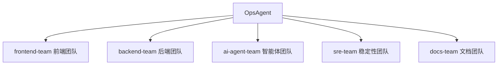
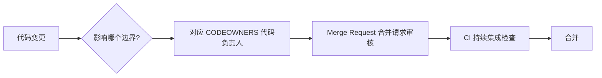

# Team Ownership 团队责任边界

OpsAgent 当前由一个人开发，但目录和审批意识按企业团队拆分。这样做不是为了增加复杂度，而是为了让 demo（演示项目）能模拟真实研发组织的协作边界。

## 责任表

| 团队 | 负责范围 | 典型目录 |
|---|---|---|
| frontend-team | 页面、交互、故障按钮、报告展示、Source Map（源码映射文件） | `apps/frontend/`、`packages/ui/` |
| backend-team | API（接口）、业务故障、数据库访问、日志和 Trace（链路追踪）埋点 | `apps/backend/`、`packages/api/`、`packages/db/` |
| ai-agent-team | Mastra（智能体框架）、Prompt（提示词）、Tools（工具调用）、Workflow（工作流）、模型降级 | `apps/agent/`、`packages/shared/` |
| sre-team | Docker Compose（容器编排）、环境变量、可观测性、CI/CD（持续集成与持续交付） | `observability/`、`docker-compose.yml`、`packages/config/`、`packages/env/` |
| docs-team | README（项目说明）、任务拆分、面试讲解、Runbook（处置手册） | `docs/`、`README.md` |

## 模拟审批规则

| 变更类型 | 建议审核人 |
|---|---|
| 前端页面或 UI（用户界面）组件 | frontend-team |
| 后端 API（接口）或数据库模型 | backend-team |
| Agent（智能体）分析逻辑 | ai-agent-team |
| Docker（容器）、可观测性、CI/CD（持续集成与持续交付） | sre-team |
| 文档、面试表达、任务拆分 | docs-team |

## 面试表达

> 虽然 OpsAgent 是个人项目，但我按企业项目方式设计了 ownership（责任归属）：前端、后端、智能体、SRE（站点可靠性工程师）和文档各有边界。后续本地 GitLab（企业代码托管平台）会用 CODEOWNERS（代码负责人）和 Protected Branch（受保护分支）模拟真实团队审批。

