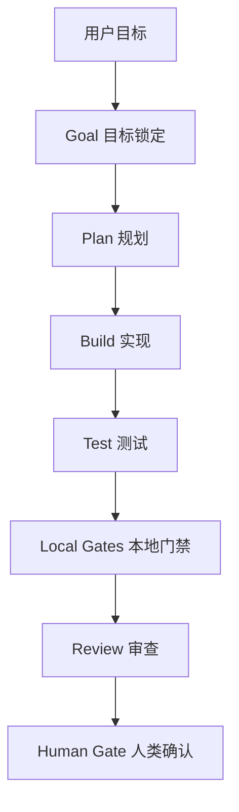
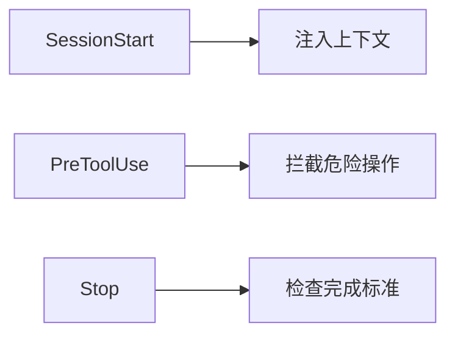
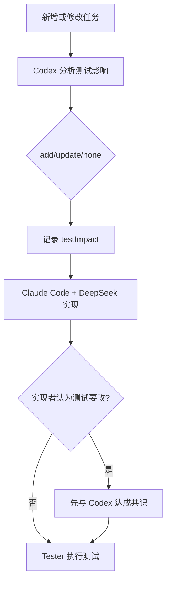

# Agent 执行工作流

本文档定义 OpsAgent 的通用 Agent（智能体）执行工作流。它不只服务 M0，也适用于后续 M1、M2、M3，以及未来其他项目。

## 1. 核心目标

用 `/goal` 和 hooks（钩子）约束 Claude Code、DeepSeek、Codex 等 Agent（智能体）按流程完成任务，避免跳步骤、提前宣布完成、漏跑验证、越界改文件。



## 2. 通用执行流程

| 阶段 | 说明 | 产出 |
|---|---|---|
| Goal | 用 `/goal` 明确完成条件 | 可检查的完成标准 |
| Plan | 阅读任务文档，确认范围、风险、不做什么 | 简短计划 |
| Build | 按任务 ID 执行，不扩大范围 | 文件改动 |
| Test Strategy | 每次新增或修改任务时，由 Codex 判断测试需新增、修改或无需变化 | `testImpact` 测试影响记录 |
| Test | 由 tester（测试角色）执行正常、失败和回归场景 | 测试证据 |
| Local Gates | 跑类型检查、构建、配置检查和任务角色校验 | 门禁证据 |
| Review | reviewer（审查角色）检查代码和测试证据 | 审查结论 |
| Status Gate | 更新 README（项目说明）、任务文档或状态文档 | 文档同步 |
| Human Gate | 向用户报告结果和风险 | 可审核总结 |

## 3. /goal 模板

通用模板：

```text
/goal <任务 ID> 闭环完成：已阅读对应任务文档；只修改任务范围内文件；完成任务要求的交付物；运行任务指定验证命令并记录结果；更新 README 或 docs 中的相关入口；未提交密钥、Token（访问令牌）、.env；最终汇报包含已完成、未完成、验证命令、风险和下一步；git status 干净或只剩用户明确允许的改动。
```

M0 示例：

```text
/goal M0 项目骨架闭环完成：apps/frontend、apps/backend、apps/agent、packages/shared、observability、docs 目录存在；pnpm workspace 和 turbo 最小配置可用；packages/shared 可构建；docker-compose.yml 至少包含 PostgreSQL 和 Redis 且 docker compose config 通过；.gitignore、.env.example、CODEOWNERS 和 docs/team-ownership.md 已创建；README 链接到 M0 文档；git status 干净或只剩用户明确允许的改动。
```

## 4. Hook 门禁

建议 hooks（钩子）分三类：

| Hook | 触发时机 | 作用 |
|---|---|---|
| SessionStart / Setup | 会话开始 | 注入 README、任务拆分、当前任务摘要 |
| PreToolUse | 工具调用前 | 阻止越界写入、阻止写入密钥、提醒读取任务文档 |
| Stop | Agent 准备停止时 | 检查验收项，没完成就不允许声称完成 |



OpsAgent 当前落地文件：

| 文件 | 作用 |
|---|---|
| `.claude/settings.json` | Claude Code hooks（钩子）配置 |
| `.claude/hooks/pre-tool-guard.sh` | 工具调用前门禁，阻止密钥写入、危险命令和 M0 越界改动 |
| `.claude/hooks/stop-check.sh` | 停止前门禁，按 active goal（当前目标）检查验收项 |
| `.agent/role-policy.json` | 机器可读的架构、实现、测试、审查和批准角色策略 |
| `.agent/active-task.example.json` | 活动任务模板，包含 tester（测试角色）和 testEvidence（测试证据） |
| `packages/workflow-gates/src/rolePolicy.ts` | Stop hook 使用的角色与测试证据校验器 |

### 4.3 测试用例变更协议



Claude Code + DeepSeek 不得单方面修改既有测试合同。若认为测试需要调整，必须说明是需求变化、测试错误还是覆盖不足，由 Codex 审核并在 `testImpact.consensus` 中记录 `approved` 后再修改。

### 4.1 active goal 开关

默认情况下，Stop hook（停止钩子）只提示，不强制检查。要开启某个任务的严格门禁，在项目根目录创建：

```bash
mkdir -p .claude
printf "M0\n" > .claude/active-goal
```

关闭严格门禁：

```bash
rm .claude/active-goal
```

这样设计是为了避免日常聊天或小文档修改被 M0 验收项误拦截。

### 4.2 本地手动验证 hooks

测试 PreToolUse（工具调用前门禁）是否阻止写 `.env`：

```bash
printf '{"tool_name":"Write","tool_input":{"file_path":".env"}}' | bash .claude/hooks/pre-tool-guard.sh
```

测试 M0 Stop hook（停止钩子）：

```bash
printf "M0\n" > .claude/active-goal
bash .claude/hooks/stop-check.sh
```

如果 M0 文件还没创建，这个命令应该失败；等 M0 完成后，它应该通过。

## 5. Stop Gate 检查清单

Stop hook（停止钩子）应检查：

- [ ] 是否阅读并引用当前任务文档
- [ ] 是否只修改任务范围内文件
- [ ] 是否创建或修改了必要交付物
- [ ] 是否运行验证命令，或明确说明不能运行的原因
- [ ] 是否更新 README（项目说明）或 docs（文档）入口
- [ ] 是否没有提交 `.env`、密钥、Token（访问令牌）
- [ ] 是否给出清晰总结

## 6. Circuit Breaker

Circuit Breaker（熔断规则）用于防止 Agent（智能体）在错误方向上反复尝试。

| 规则 | 处理 |
|---|---|
| 同一问题修复 3 轮仍失败 | 停止并汇报 blocker（阻塞点） |
| 连续 2 次修复引入新失败 | 停止，要求重新规划 |
| 涉及删除数据、密钥、发布生产 | 必须人类确认 |
| 架构分歧无法收敛 | Claude / Codex / DeepSeek 独立给方案，再交叉比较 |

## 7. 完成汇报模板

```text
<任务 ID> 完成情况：
- 已完成：
- 未完成/延期：
- 验证命令：
- 风险：
- 下一步建议：
```

## 8. 适用范围

| 场景 | 是否适用 |
|---|---:|
| M0 项目骨架 | 是 |
| M1 业务系统 | 是 |
| M2 可观测性 | 是 |
| M3 Agent 分析 | 是 |
| 小文案修改 | 可简化使用 |
| 高风险架构决策 | 必须配合跨模型审查 |
