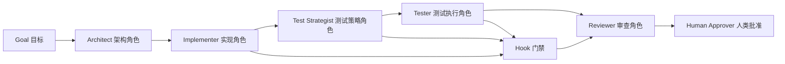
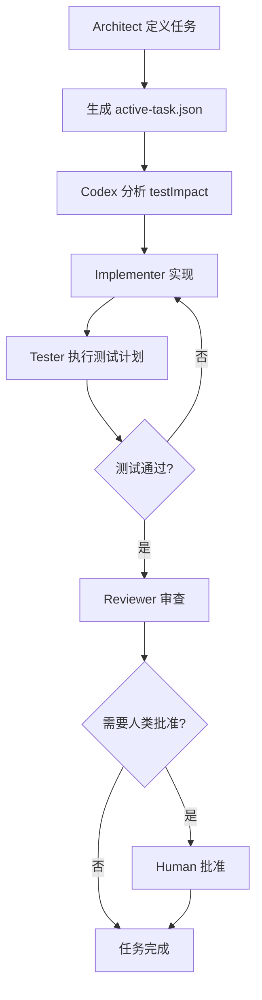
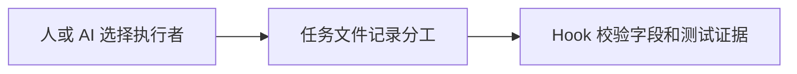

# Agent Role Policy 智能体角色策略

## 1. 目标

这份策略回答两个问题：

1. 当前任务应该由谁负责、谁实现、谁测试、谁审查。
2. 任务进入完成状态前，必须提供哪些测试证据。

Hook（钩子）不负责自动召唤某个 AI（人工智能），只负责读取任务声明并执行确定性校验。



## 2. 角色

| 角色 | 当前执行者 | 主要职责 |
|---|---|---|
| architect（架构角色） | gpt5.5 | 架构、任务拆分、验收标准、风险判断 |
| implementer（实现角色） | Claude Code + DeepSeek | 按任务范围编码、修复、提交实现说明 |
| test-strategist（测试策略角色） | Codex | 每次任务新增/修改时分析测试影响，设计或审核测试用例 |
| tester（测试角色） | QA Agent（测试智能体）；当前可由新上下文 Claude Code + DeepSeek 代行 | 测试计划、正常/失败路径、回归检查、测试证据 |
| reviewer（审查角色） | gpt5.5 | 代码审查、架构审查、测试证据审查 |
| approver（批准角色） | Human（人类） | 范围决策、冲突裁决、提交和发布授权 |

测试策略和测试执行必须独立列出。个人项目允许同一个模型代行实现和测试，但测试阶段应使用新上下文，并从验收标准出发验证，避免直接重复实现者的自我判断。

Claude Code + DeepSeek 如果认为已有测试需要修改，必须先在 `testImpact`（测试影响）中提出理由，与 Codex 达成共识后才能修改。测试失败时默认优先修业务代码，不能为了让检查通过而自行降低测试标准。

## 3. 任务流



## 4. 机器可读文件

| 文件 | 作用 |
|---|---|
| `.agent/role-policy.json` | 定义角色和任务类型的默认分工 |
| `.agent/active-task.example.json` | 当前任务声明模板 |
| `.agent/active-task.json` | 本地活动任务，不提交 Git |

开始任务时：

```bash
pnpm task:create -- M1-01 "实现健康检查接口" implementation
```

随后使用 `task:scope`、`task:criteria`、`task:test-impact`、`task:test-plan` 和 `task:verify-command` 补齐任务合同，再通过 `task:handoff` 在角色之间交接。

如果 `task:test-impact` 的 `proposedBy` 是 `implementer`，共识会保持 `pending`；必须由 Codex 执行 `pnpm task:test-approve` 后才能送审。

任务状态：

| 状态 | 含义 |
|---|---|
| `planned` | 已定义任务，尚未实现 |
| `implementing` | 实现中 |
| `testing` | 测试中 |
| `ready_for_review` | 测试通过，等待审查 |
| `completed` | 审查和必要的人类批准完成 |

当状态为 `ready_for_review` 或 `completed` 时，`testEvidence`（测试证据）不能为空。

每个任务还必须声明 `testImpact`：

| 字段 | 说明 |
|---|---|
| `action` | `add` 新增测试、`update` 修改测试、`none` 无需变化 |
| `rationale` | 测试影响判断理由 |
| `proposedBy` | 谁提出测试变化 |
| `reviewedBy` | 必须是 `test-strategist` |
| `consensus` | 必须为 `approved` 才能通过门禁 |

## 5. 当前限制

当前策略不会自动调用 gpt5.5、DeepSeek 或 QA Agent（测试智能体）。它实现的是：



真正的自动多 AI 调度属于后续 orchestrator（编排器）能力，不能用 hook 冒充。

CLI（命令行工具）目前只记录角色声明和批准结果，不能以密码学方式证明实际调用者就是 Codex。M0 阶段依靠 Git（版本控制）权限、提交审查和人工纪律保证可信度；可验证身份与自动调度留给后续编排器实现。
